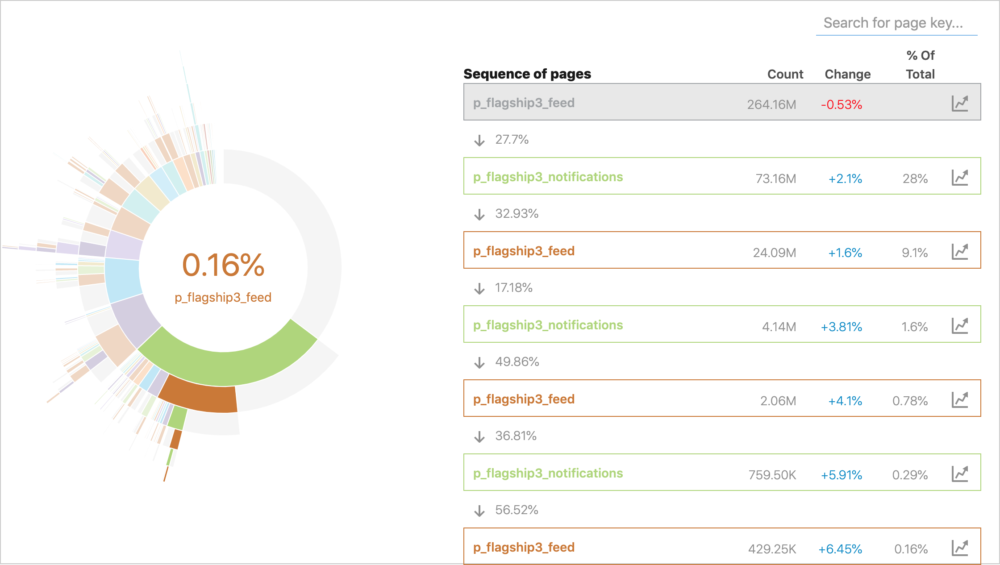
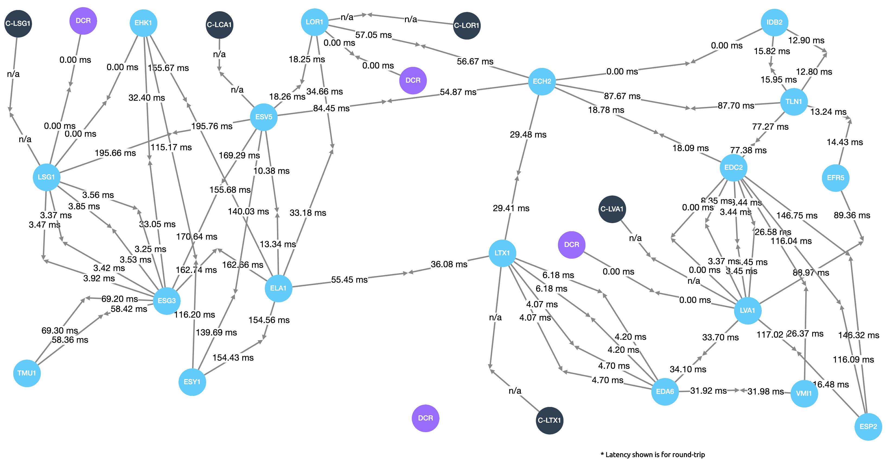

+++
title = "Data Viz: Clarity & inDC"
date = "2019-06-20"
slug = "data-viz-clarity-indc"
draft = false
+++

This week I thought about doing a post on a recent [Major GCN of Greatness. I mean, look at the thing! I count no fewer than 75 inGraphs links in there. ...](https://jira01.corp.linkedin.com:8443/browse/GCN-29770) but ultimately I wasn't feeling a "Things got broke and then they got better" story, so I decided to share a couple of internal examples of different data visualization tools that folks might be interest in.

First up is [Clarity:](https://tools.corp.linkedin.com/apps/tools/clarity/clarity/v2/nodes/view/qChu_Nbk/funnels-outgoing)

Clarity can show a handful of different metrics for different flows/pagekeys on the site, but one of the more interesting features it has is funnel tracking. The above sunburst chart shows the outbound funnel from feed - that is, "Where do people go next?" This might be useful information to have if you're trying to gauge the effectiveness of a lix that promotes a certain feature on the feed, or if you're trying to make smart decisions about selectively pre-fetching data.

heh Also...it looks cool.

[Next up, inDC](http://indc.corp.linkedin.com/interdc?filter=latency&view=bbr):

I don't know exactly what to call this one. A "daddy long-legs high-fiving chart"? Anyhow, this particular...err...DLLHFC (needs more cowbell) shows round- trip latency between our different data centers. I haven't played with this tool a whole lot, but it also lets you see things like overall traffic, packet loss, and inbound/outbound errors. Pretty cool stuff.

A couple of links if you feel like playing around with either of these:

Clarity: [https://tools.corp.linkedin.com/apps/tools/clarity/clarity/v2/nodes/view/qChu_Nbk/funnels-outgoing](https://tools.corp.linkedin.com/apps/tools/clarity/clarity/v2/nodes/view/qChu_Nbk/funnels-outgoing)

[inDC: http://indc.corp.linkedin.com/interdc?filter=latency&view=bbr](http://indc.corp.linkedin.com/interdc?filter=latency&view=bbr)

Have fun!
