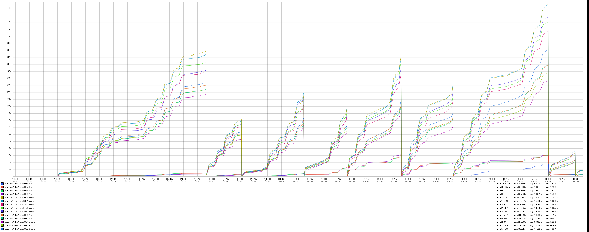

+++
title = "Independence Day"
date = "2019-07-04"
slug = "independence-day"
draft = false
+++

I spent some time last night writing, got through about 3/4 of a post before going to bed...and ultimately decided to save it for next week and just ship this, instead:

_Chris Carini sent this one my way (and IIRC __Josiah Bradley_ sent it to *him*). Looks a bit like flags fluttering in the breeze, no?

Happy Fourth, folks!
