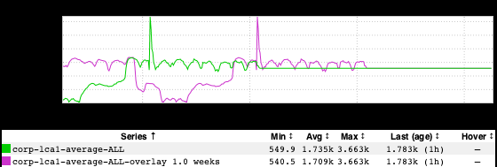
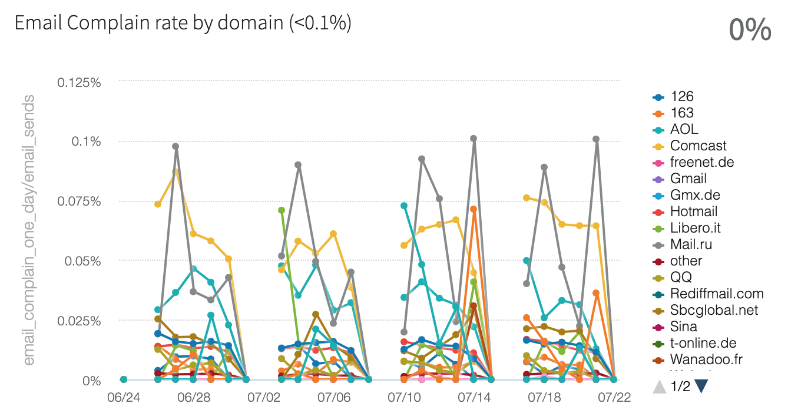
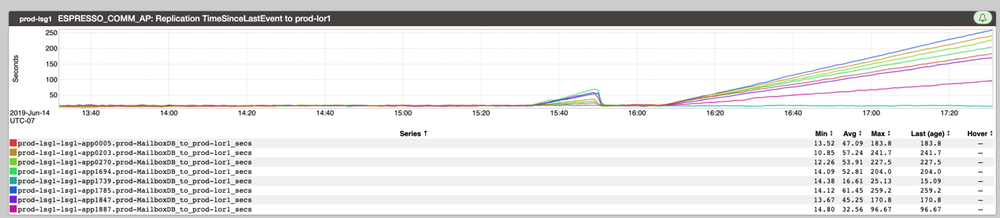
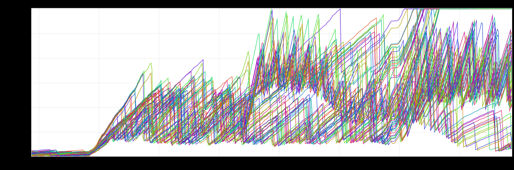
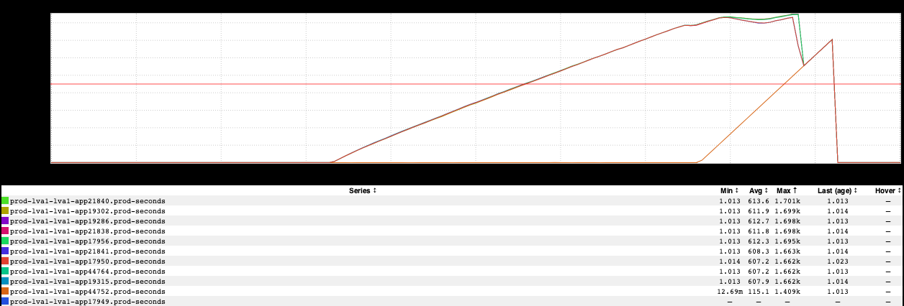

+++
title = "Unintentional Art (August 2019)"
date = "2019-08-09"
slug = "unintentional-art-august-2019"
draft = false
+++

_This week I've just got a few bits and bobs from here and there. First up, an example of The __Flatline__ __:_

Next up, a wonderfully-jumbled Raptor dashboard that - in the abstract - kinda looks like a series of constellations of...hmmm...a horse? Mebbe a guy riding a horse? There's definitely a horse in there.

_Then there's this cool prism rainbow from Alexsandra McMahan_:

...and this super high-energy jobbie that _Mark Feinstein sent my way:_

Rounding it out is a replication lag inGraph that _Karrick McDermott_ sent to me a little while back:

This one actually had me puzzling over it for a little bit trying to figure out exactly what was going on...but ultimately I decided to resist the nerd-snipe.  (If [you're interested in taking a closer look: http://ingraphs.prod.linkedin.com/snapshot/this%20is%20your%20database%20replication%20on%](http://ingraphs.prod.linkedin.com/snapshot/this%20is%20your%20database%20replication%20on%20conntrack_20190717_213816/) [20conntrack_20190717_213816/)](http://ingraphs.prod.linkedin.com/snapshot/this%20is%20your%20database%20replication%20on%20conntrack_20190717_213816/)
