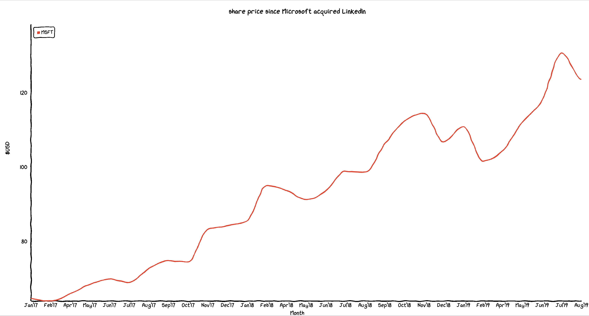
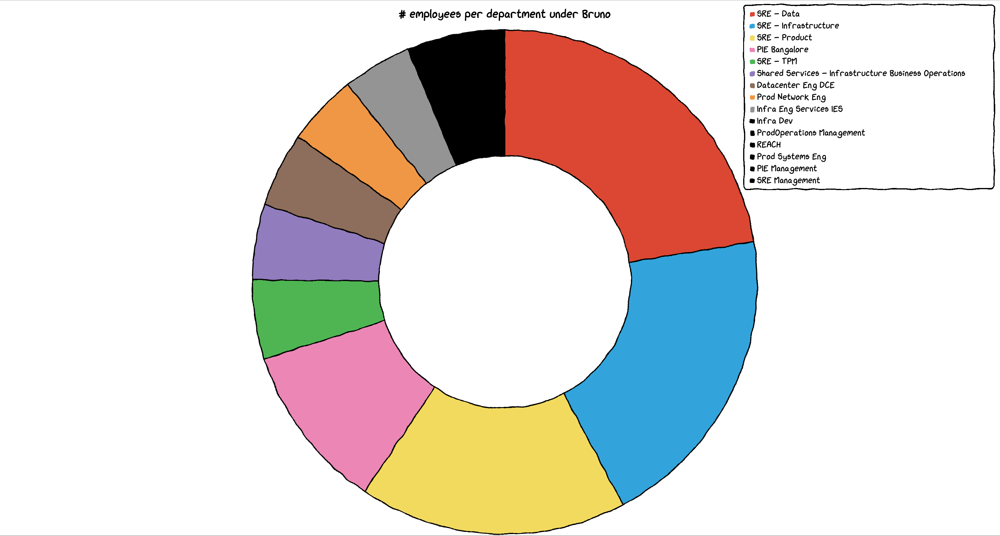

+++
title = "chart.xkcd"
date = "2019-08-22"
slug = "chart-xkcd"
draft = false
+++

[I stumbled across chart.xkcd earlier this week - a nifty little library that draws charts in a "hand-drawn" style, ala ](https://timqian.com/chart.xkcd/)[xkcd](https://xkcd.com/). Initial thought: "Oh, cool!" ... immediately followed by "Welp. There goes two hours of my life."

The first one I decided to tackle was the line chart. A bit of fiddling around on [Yahoo Finance, some massaging to make the x-axis labels non-overlapping, ](https://finance.yahoo.com/quote/MSFT/history?p=MSFT) *et voila*!

_Next up I thought I'd try using the donut chart to show the distribution of titles in Bruno Connelly_'s org. Man...that turned out to be a data quality nightmare. _inchart spewed forth a murky bucket of non-standardized job titles. No shit, Nicholas Han_'s "short" title as listed by inchart is "Mgr, SREing". I thought about doing manual data cleanup and decided I didn't wanna, so I thought about doing location instead. This proved to have some discrepancies in standardization, as well - sometimes the full address is listed, sometimes just the city, Bangalore vs. Bengaluru, etc. It would've been easier to clean up than titles...but I still didn't wanna. So I turned to departments. This was *much* better, although it exposed an interesting limitation; it looks like once you get beyond 10 categories the library runs out of colors and just starts mapping each category in the "long tail" onto black:

[When it came time to look at the bar chart, I thought to myself "What would Randall Munroe do?" I ended up deciding on a bar chart of planetary radii. At ](https://en.wikipedia.org/wiki/Randall_Munroe) first I was representing them in kilometers, but that actually exposed another shortcoming of the library; due to a formatting bug numbers with more than 5 [digits were being labeled as "0,000". Hrm. Luckily the site I used to get the data](https://www.universetoday.com/36649/planets-in-order-of-size/) also had the radii listed relative to Earth's radius, so I just used that instead:

[There are a bunch of nifty little features that you can't see in static screenshots - rollover transitions, tooltips, etc. To that end I went ahead and create a gitli](https://git.corp.linkedin.com:1367/plugins/gitiles/csnyder/chart.xkcd)

[repo and stashed these three examples in it. Feel free to clone it and hack away to your heart's content! ](https://git.corp.linkedin.com:1367/plugins/gitiles/csnyder/chart.xkcd)

***Update:*** *When I was mucking about with the data labels on the share price graph it looks like I completely forgot about the month of March, which skews* *the data in the screenshot. I'm going to leave it for posterity, but I've fixed the data in the git repo. Thanks to the sharp eyes of* *Micah Stubbs for catching it!*

