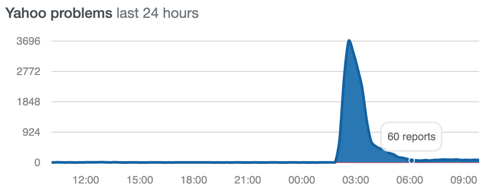
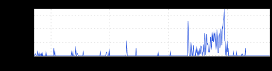
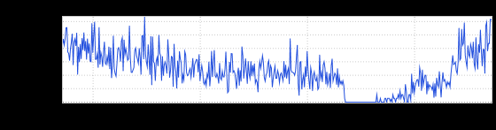

+++
title = "Yahoo!"
date = "2019-09-05"
slug = "yahoo"
draft = false
+++

[I saw some chatter in slack](https://linkedin-randd.slack.com/archives/C0881KF9P/p1567665434296400) this morning about folks not being able to resolve DNS for [www.yahoo.com](http://www.yahoo.com.), so I started doing a little poking around. My first [visit was to Downdetector, which looked a little like this:](https://downdetector.com/status/yahoo)

Okay, so people on the Internet noticed it. ...but did *we* (meaning LinkedIn) notice it? There may be other places where we leverage Yahoo APIs, but the one that jumped most immediately to mind was contact imports. Once Upon a Time I probably would've had the dashboard memorized, but I haven't worked in the Growth space for a little while so it took me a bit of grepping around:

metrics -fg prod list -s zeppelin > zeppelin.metrics && grep -i yahoo !$

That turned up a list of pretty likely candidates - things with names like:

zeppelin/zeppelin.i001.Zeppelin_Provider_Sensor.Zeppelin_Provider_Stats.yahoo_ERROR.rrd

zeppelin/zeppelin.i001.Zeppelin_Provider_Sensor.Zeppelin_Provider_Stats.yahoo_SUCCESS.rrd

So what did those look like?

Yep. As expected, errors went up and successes went down (in fact, went to zero) in close alignment with that timeframe.

So I *do* still remember how to inGraphs! Coolcoolcool.
