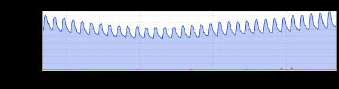
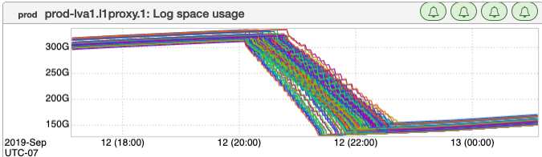
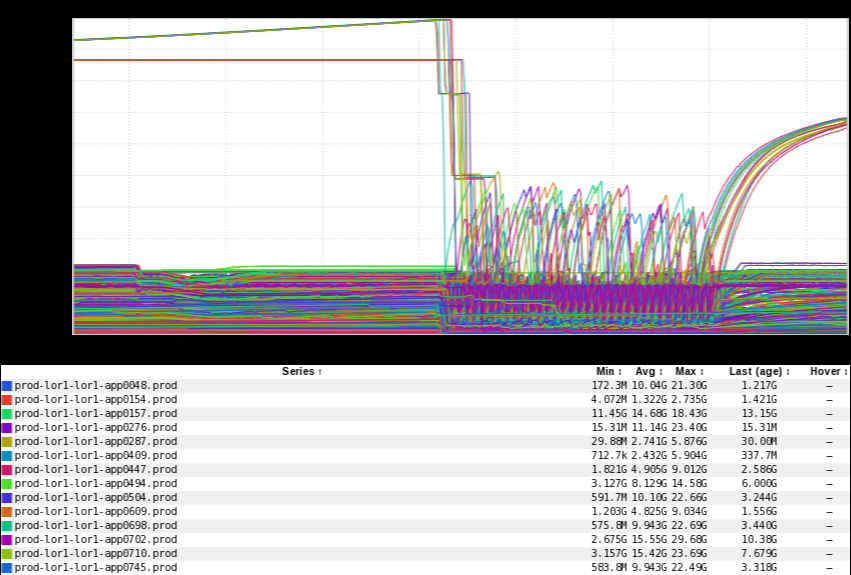
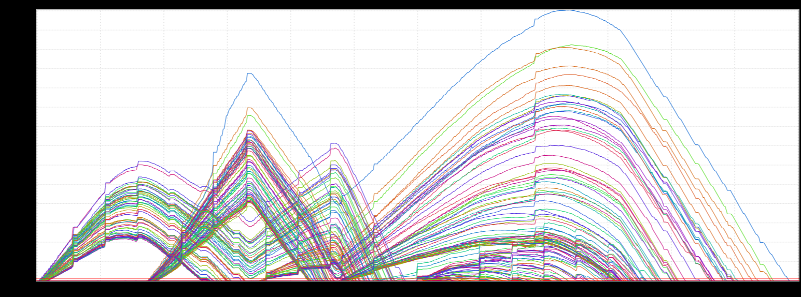
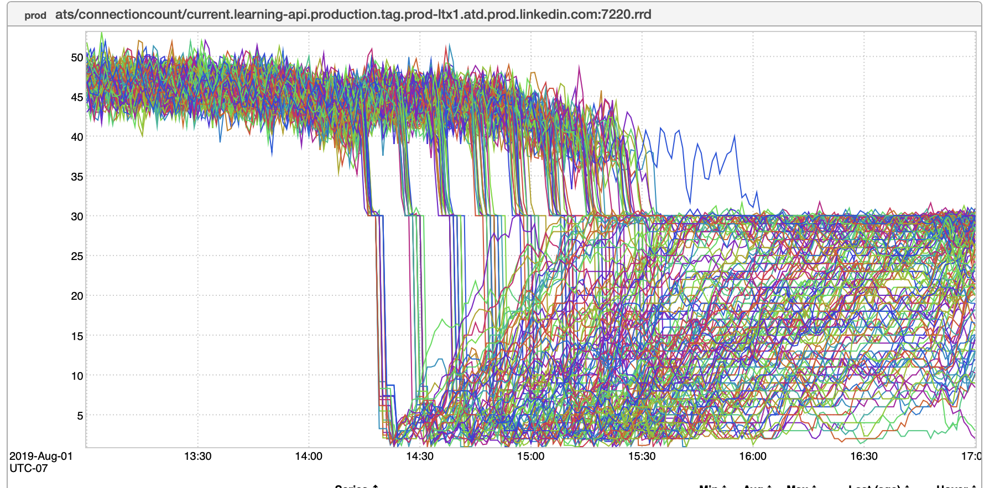

+++
title = "Unintentional Art (September 2019)"
date = "2019-09-24"
slug = "unintentional-art-september-2019"
draft = false
+++

Hoo boy, it's been A Week. I had a few ideas for posts, but ultimately I decided to fall back on the old, reliable UA format. Let's get through this inDay and into the weekend, shall we?

This first one caught my eye because it looks quite a bit like something I _posted in the past:_

Perhaps Ze Germans just really like Groups, mmm?

_The rest are various takes on a rainbow theme. Like this log cleanup graph that Kenneth Lu posted in some slack channel or other:_

[This Viking ship (or maybe it's Nessie?) that I believe ](https://en.wikipedia.org/wiki/Loch_Ness_Monster)_Adam Debus linked to:_

_This rainbow mountain range that Jim Ockers_ sent my way:

...and, last but not least, one of the most Metal inGraphs I think I've ever seen. Femi sent this one my way. Femi...I'll miss ya, buddy.

Hey also, it's been a while since I mentioned the [igotw-submissions distro. I think perhaps 3 people have used it Ever - sometimes  ](mailto:igotw-submissions@linkedin.com) even forget it exists - *I* but if you've got a cool inGraph or an idea for a post, feel free to hit me up!

***Update (2019-09-24):*** A handful of folks have expressed concerns about Femi's whereabouts. Femi is alive and well, he's just moved on to his Next Play. Apologies for any consternation this may have caused.
