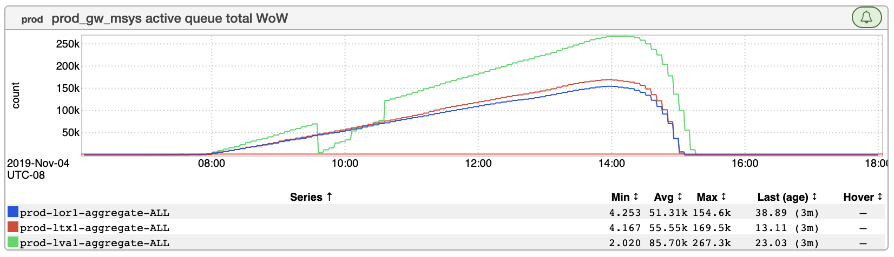
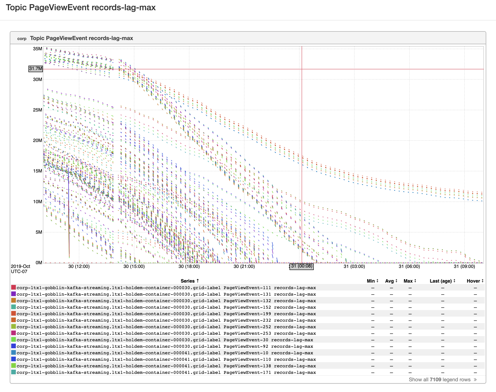

+++
title = "Unintentional Art (Family inDay)"
date = "2019-11-15"
slug = "unintentional-art-family-inday"
draft = false
+++

This morning I was thinking about Family inDay last year, which also happened to be _Bring In Your Parents Day_ (TIL: it got moved from November to May this time ‘round). My mom participated last year and I had her pick out the graphs for that week’s _igotw_. Something I didn’t mention in that post: my youngest sister was 9 months pregnant at the time.

I think my sister was a little bit salty that I flew her mother all the way to the other side of the country that close to her due date. How close? Well, Family inDay was on 11/16, we flew back on 11/17, and my nephew was born on 11/18. So...pretty close. :-D

Anyhow, today we’re having a little first birthday celebration for Caleb, so I thought I might pick out a few bits of UA and try and think about how a 1-year- old might perceive them.

First up I've got a graph that I believe _Bhaskar Bhowmik sent my way not too long ago. To an SRE it looks like a pretty scary jump in 5xx...but Cay-Cay _ might think it looks a little like a fuzzy caterpillar.

Then I've got this one from _Chris Carini. It's mail queue lag, but to a 1-year-old maybe it might look like...hmm...an elephant? ...or maybe a train?_

I can't remember who sent me this next one for the life of me, but Young C-Money might think it's a children's artist rendition of a weeping willow:

...and, last but not least, a redliner run gone awry that reminds be an awful lot of a [Bumbo](https://www.google.com/search?q=bumbo):

Happy Family inDay, folks!
