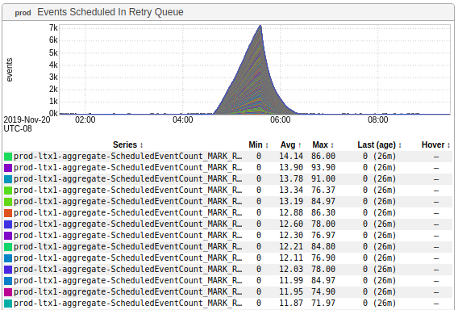

+++
title = "Happy Thanksgiving (2019)"
date = "2019-11-27"
slug = "happy-thanksgiving-2019"
draft = false
+++

This week I've got a graph that _Patrick Fairbank_posted recently in some slack channel somewhere. It looks like a shark fin:

What do sharks have to do with Thanksgiving? Not a damn thing.

...or do they?

[I suspect a lot of folks have already seen Jessica's Daily Affirmation - it's an "oldie but a goodie" - and if you haven't it's worth a watch (and under a minute ](https://www.youtube.com/watch?v=qR3rK0kZFkg&feature=youtu.be) long). I reckon Jessica sound pretty thankful for a whole lot of things...and she just so happens to start her process with "Look, I can be a shark!"

Happy Thanksgiving, folks!
