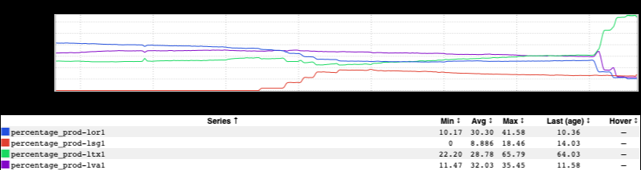
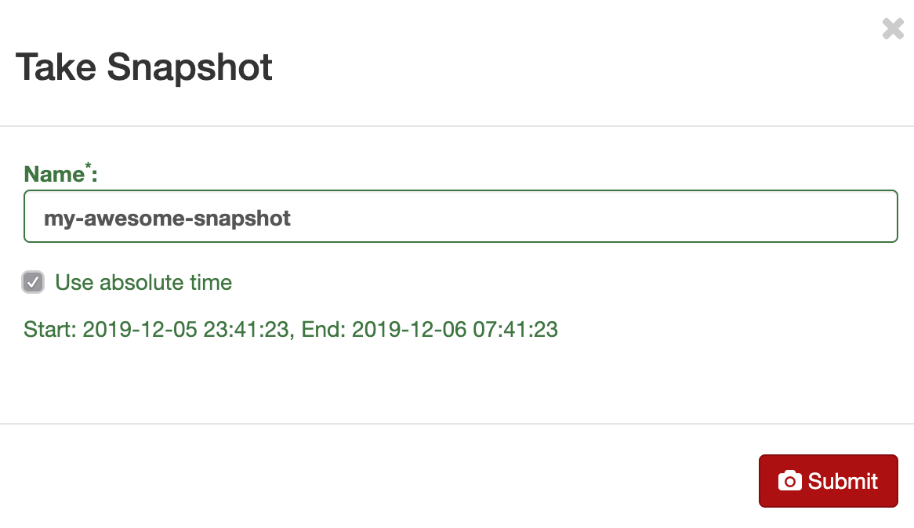
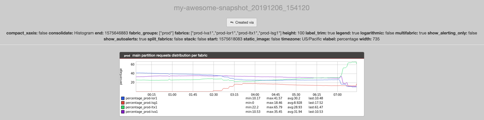

+++
title = "Absolute Time"
date = "2019-12-06"
slug = "absolute-time"
draft = false
+++

It's been a while since the last time I posted about an inGraphs feature, but I recently discovered a nifty bit of (new?) hotness that I thought I'd share. Suppose you're looking at an inGraph:

You happen to think it's pretty interesting and you'd like to share it, so you click the button in the upper righthand corner to generate a snapshot:

At this point inGraphs presents you with a dialog that looks like this:

You pick a name, click "Submit", and you get something like this:

Link: [https://ingraphs.prod.linkedin.com/snapshot/my-awesome-snapshot_20191206_154120/](https://ingraphs.prod.linkedin.com/snapshot/my-awesome-snapshot_20191206_154120/)

...but wait. Back up a tick. What's this "Use absolute time" checkbox? Where did that come from? That wasn't there before!

<this is the part where I get excited>

The "normal" behavior of inGraphs snapshots - the behavior if you do not check the "Use absolute time" box - is to construct the "Created via" link more or less exactly how it looked at the time the snapshot is created. That might look something like this:

[https://ingraphs.prod.linkedin.com/dashboard/stickyrouting/graph/main%20partition%20requests%20distribution%20per%20fabric?](https://ingraphs.prod.linkedin.com/dashboard/stickyrouting/graph/main%20partition%20requests%20distribution%20per%20fabric?fabric_groups=prod&width=735) [fabric_groups=prod&width=735](https://ingraphs.prod.linkedin.com/dashboard/stickyrouting/graph/main%20partition%20requests%20distribution%20per%20fabric?fabric_groups=prod&width=735)

The behavior when you check the box is to generate the "Created via" link *as well as injecting time selector parameters for the time at which the snaposhot* *was taken*:

[https://ingraphs.prod.linkedin.com/dashboard/stickyrouting/graph/main%20partition%20requests%20distribution%20per%20fabric?](https://ingraphs.prod.linkedin.com/dashboard/stickyrouting/graph/main%20partition%20requests%20distribution%20per%20fabric?fabric_groups=prod&width=735&use_time_selector=&start_time=1575618083017&end_time=1575646883017) [fabric_groups=prod&width=735&use_time_selector=&start_time=1575618083017&end_time=1575646883017](https://ingraphs.prod.linkedin.com/dashboard/stickyrouting/graph/main%20partition%20requests%20distribution%20per%20fabric?fabric_groups=prod&width=735&use_time_selector=&start_time=1575618083017&end_time=1575646883017)

The former *might* be what you want some of the time, but I suspect that the latter is much more commonly-desired behavior. I can't tell you how many times I've clicked on a snapshot link in a GCN, clicked through "Created via" so I can explore the metric a bit for myself, realized that the graph I was looking at was for the present time (as opposed to the time when the GCN was actually popping off), and then had to spend 5-10 minutes futzing around adjusting the time range on the damn thing to see what it looked like when the GCN was actually happening.

The thing I might love most about this is precisely its subtlety. It's not flashy - it's one small checkbox that wasn't there previously. It's not novel - this behavior can also be achieved by the snapshot creator configuring the graph to use time selectors in the first place.  ...but this one tiny incremental improvement - just a little checkbox placed at the point of need at snapshot creation time - is the kind of user-focused detail that results in genuine delight.
