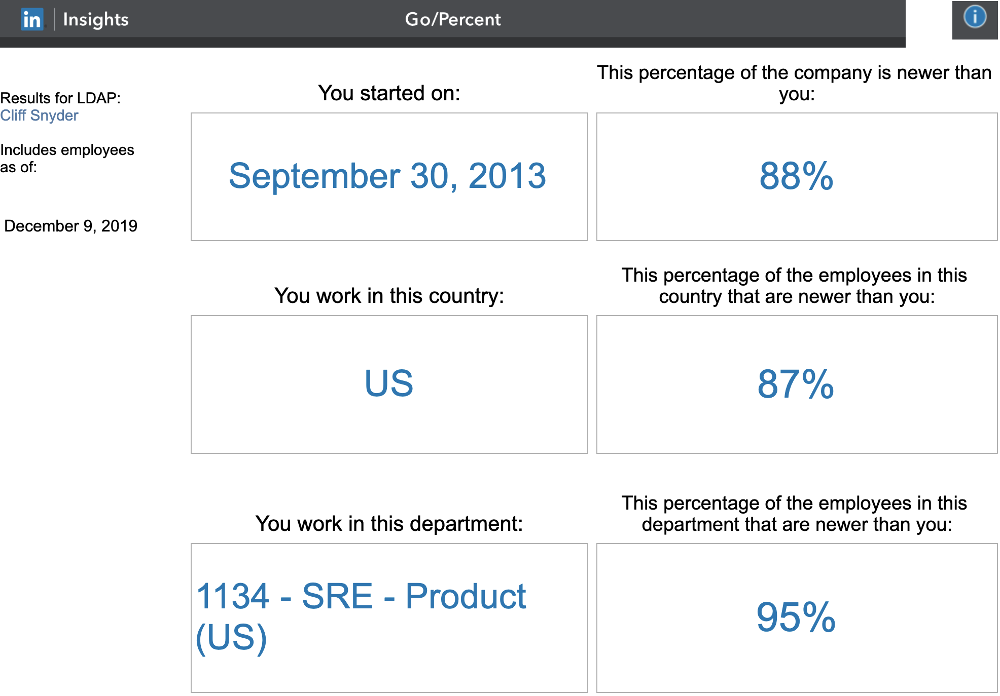

+++
title = "go/percent"
date = "2019-12-13"
slug = "go-percent"
draft = false
+++

This month’s inDay theme is Reflection - makes sense for December, I reckon - and I’ve been mentally looking back over the 6+ years I’ve spent at LinkedIn. Some of that thinking is about things I’ve done - things I’ve worked on, things I’ve built, things I’ve accomplished, etc. - but mostly it’s about people. The folks I’ve had the opportunity to work with. The ones I’ve been on the interview panel for (I maintain a mental toplist of “Proudest Hires”). The ones who have left (and, sometimes, who have come back). The ones who I’ve had a meal or a beer with. The ones who have met my mom and sisters, or met my wife and kids. The ones who actually remember my kids’ ages or names (a vanishingly small subset).

I also decided to take a peek at _go/percent_, an internal tool we have that shows what percentage of the people at the company were hired after you. It looks something like this:

Once upon a time go/percent allowed searching for the results for arbitrary LinkedIn employees, which could be a fun little diversion - a kind of “scavenger hunt” to find the least-/most-tenured employees. Sadly it looks like that capability has been removed; you can only see your own results now. Even so, it’s a fun little tool that may provide a little data for your own personal trip down memory lane.

Happy inDay, folks! :-)
