+++
title = "Rolling Reboots and the Last Tranche"
date = "2020-01-23"
slug = "rolling-reboots-and-the-last-tranche"
draft = false
+++

***[The following is a guest post written by*** ***Brandon Matthews*** ***link to his original (******). It's a little longer (and decidedly more math-y) than the typical*** ***igotw, but I think he presents some findings that are super-interesting. Thanks, Brandon!]***

The other day, I happened across the following graph:

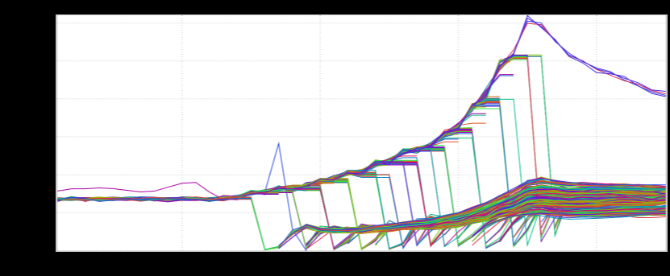

This is a graph of QPS per host during a rolling restart. That's a really interesting load pattern, isn't it? A *lot* of traffic gets shunted into just a few nodes! This much traffic could potentially crash the nodes that are seeing such a huge increase. Seeing this graph reminded me of an analysis I did a few years ago of (ultimately misguided) attempts to prevent this exact scenario.

Long ago, I got a flood of alerts for high CPU usage. As it turns out, a developer was doing a deploy of the latest sprint release. There appeared to be a correlation, and upon investigation we noticed an odd pattern: there was a sort of "wave" of load that looked just like the above graph. As the release went on, the load on the untouched servers got higher and higher. It was like the remaining servers were getting "squeezed".

This was a problem that needed to be solved. We couldn't have nodes going down every time we released. The initial response was to divide the infrastructure up into "tranches" or "batches" of servers, and only release to one batch at a time. Imagine our surprise when it didn't help! So we fiddled with the process and increased the number of tranches, thinking this would help. But it didn't! That got me thinking: what is the actual effect of resizing the tranches? Could I model this system to predict what effect future changes would have?

Frictionless Spherical Servers in a Vacuum

In this analysis, I make a few simplifying assumptions. Interestingly, those assumptions map quite closely to real-world use cases here at LinkedIn. Specifically, they map well to D2-balanced services that have longish-lived connections. The real world is messy, but I think knowing how the ideal case behaves can inform further investigations into noisier systems. Of course in reality, clients disappear, servers come up gradually, and client load grows over time.

In this case, let's take it as axiomatic that:

client connections are persistent, and a client won't disconnect unless a server goes away (thus ignoring upstream network issues), clients aggressively reconnect when disconnected (thus ignoring client misbehavior), the server pool is load balanced fairly (thus ignoring load increases caused by other factors besides the restarts), servers stay out of the pool for longer than it takes for a client to reconnect (a client will never end up on the same server).

None of these parameters are too crazy, right?

The Process of a Rolling Restart

Consider a pool of   hosts with   clients. We've already seen that something bad happens when we roll through all the hosts, so let's divide them up into   *h**m**n* tranches. At the beginning of the following scenarios, they'll have been running happily for a while, and client load per host has become evenly distributed, with *m / h* clients per host. It's release time, and the hosts must be restarted (or replaced, as the case may be).

**Scenario 1: Two tranches**

We start simple, and divide our infrastructure into two groups of hosts, and shut down half of it at a time.

At T=0, our load is evenly divided:

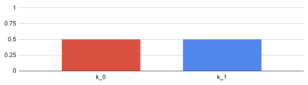

Now we shut off the servers in the first tranche (*k*. At T=1, we have moved the contents of the first tranche into the second (*k*): *0*)*1*

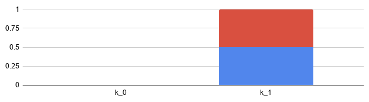

At T=2, we have completed the rollout, and moved the contents of *k* into *k* when *k* was restarted: *1**0**1*

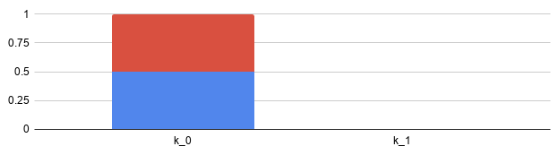

Note that the most any tranche sees is *100%* of the total load. Eventually, of course, client connections will turn over, and we'll end up load balanced evenly, but for one bright moment there, 100% of the client connections are on half of the hosts. This is a pretty obvious result, since each tranche is alone during the rollout.

Put another way, each tranche sees a 100% *increase* in load (from 1/2 to  ). In order to absorb this increase, each tranche must have twice its nominal 1 carrying capacity. Again, pretty obvious.

Doubling the load on our hosts feels like a lot. Perhaps we can do better by dividing the infrastructure up further?

**Scenario 2: Three tranches**

Let's divide our infrastructure into three tranches.

As before, at T=0, our load is evenly distributed:

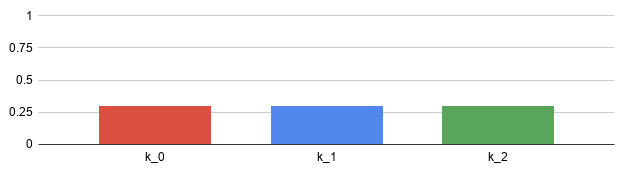

We shut off the *k* tranche, dividing its load evenly between the remaining two. At T=1, these tranches are each supporting half the load: *0*

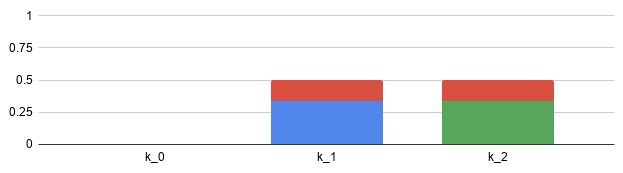

Next, we shut off *k*, diving *its* load evenly. At T=2, the first tranche *k* ends up with *1/4* of the load, while the third tranche *k* ends up carrying *3/4* of the *1**0**2* load:

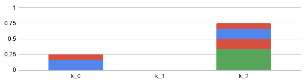

Finally, we shut off the last tranche, dividing its load in turn:

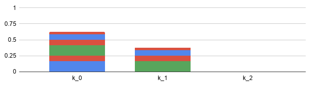

The highest load any individual tranche sees is *3/4* of the total. This is not as much in absolute terms, but what is the proportion of growth? Carrying *3/4* fro m an initial condition of *1/3* represents a *125%* increase!

Therefore, **in order to absorb the peak load, the last tranche must be over-provisioned by 125%**.

Uh oh, things aren't looking good. What if we divide our infrastructure into fourths?

**Scenario 3: Four tranches**

As before, our initial condition is an even distribution:

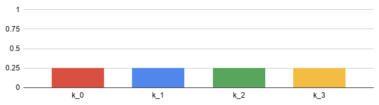

Shut off the first tranche; distribute its load:

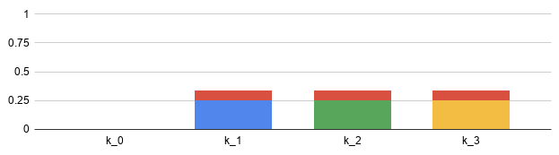

Repeat for each tranche:

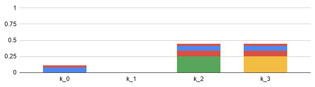

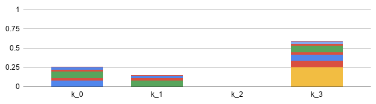

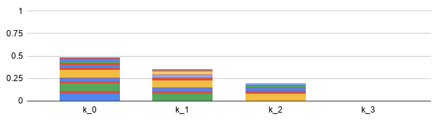

It's a bit hard to read without the actual fractions displayed, but given four tranches, the peak load seen by a tranche is *16/27*, or *~60%*.

Rising to *16/27* from *1/4* represents a *137%* increase from nominal! By now the trend is clear: **the more we subdivide our infrastructure, the harder we** **hammer the last tranche**.

Let's formalize this so we can see how bad it gets.

A formal model

**A narrative model**

Let's think about what's happening. Each time we take a tranche out of service, we divide its load up evenly across all hosts (and therefore evenly across all other tranches). As we do that, we add that load to a tranche that hasn't been touched.

The number of untouched tranches goes down every time we do that, but there's always one tranche that gets incrementally more added to it each time we take one out of rotation. And each time we take one out of rotation, we're dividing up a larger proportion traffic than the prior tranche.

At the end, there's one tranche remaining, and it's gotten a slice of every subsequently-fatter prior tranche added to it. That's the peak.

Can we calculate how bad things get?

**A mathematical model**

**Don't like math? You can skip ahead to the section Implications of subdivision and just trust me that my conclusion is correct.**

**The formula**

**I'll spare you the derivation, but doing some algebra, we find that for   tranches of   connections, we can describe the number of** ***n******m*** **connections held by the** ***last*** **tranche at the** ***n-1*** **th iteration as:**

**where**

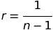

**The question**

**As   increases to infinity, what is the limit of** ***n******C*****?** ***n***

**The proof**

**Substituting  :*****r***

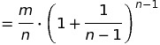

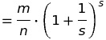

**with** ***s  n - 1*****. Let** ***h  1 / s*****:**

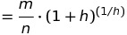

**Ah-hah! This might tickle your memory if you remember your trig! As** ***h  0*****, then** ***n *** **. Therefore, we can express the limit of** ***C*** **as** ***n ***  **in terms** ***n*** **of  :*****e***

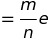

**The solution**

**If we're interested in the** ***ratio*** **of our initial value,** ***C (n) = m / n*****, to the eventual peak at some** ***C*** **for  , the result is:*****n*** ***0******n***

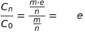

**What?**

**That's right, as we divide up the clusters more and more, the load put on the final tranche is of the order  .*****e***

[**blocked URL**](https://media.giphy.com/media/xT0xeJpnrWC4XWblEk/giphy.gif)

**If you do a one-by-one rolling restart of all of your hosts, the last host you restart will have ~*****2.7*** **times as many connections as it nominally** **carries.**

**Implications of subdivision**

We're interested in finding the amount of "squeeze" in that last tranche. How much extra capacity do we need? How much headroom, in terms of shifted connections, do our nodes need to have? If the last tranche only has, say, 20% extra capacity to carry transient load spikes or failures, is that enough?

In our simplified rolling-reboot scenario, the answer is a definite **no**. In fact, if you have less than 100% capacity, you will *never* have enough, no matter *what* you do, because the more you divide up your cluster, the *worse* it gets. All the way down to treating each *individual host* as *its own tranche*.

I find this *seriously* fascinating and *wildly* counterintuitive.

As you divide your infrastructure more and more finely in an attempt to reduce the risk of things falling over, you *increase* the spare carrying capacity necessary to handle the load transferred to the last tranche. And it's never lower than 100%! Here's what this looks like in graphical form:

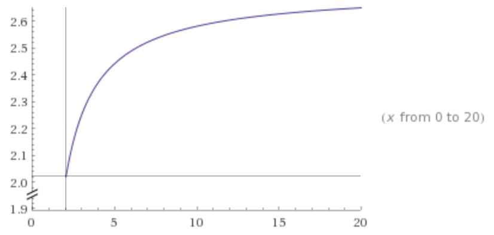

([Wolfram Alpha)](http://www.wolframalpha.com/input/?i=y%3D%28%281%2Fx%29*%28%281%2B%281%2F%28x-1%29%29%29%5E%28x-1%29%29%29%2F%281%2Fx%29+from+0+to+20)

The   axis is the number of subdivisions, and the   axis is the factor that load increases. Notice that the lowest value is 2, and it *x**y**only* goes up (and indeed approaches  ).*e*

Does this happen in reality?

Kinda. Maybe. It depends.

Look again at the graph at the very top. Load spikes from ~65 QPS to *300*. That's nearly *2 * e*. Now, I think this is likely an artifact of the metrics being misreported slightly, because the aggregate QPS number during the release period is very jaggy. Whether this actual scenario will befall you depends on a large number of factors, including client turnover rate, stickiness to clients, ability for heavily-loaded servers to shed load, load balancing strategy and so on.

Final thoughts

**The user experience**

It's worth keeping in mind that, in a rolling reboot scenario, there's some nonzero probability that a particularly unlucky user will be disconnected as many as   times as they're chased from tranche to tranche. If reconnects are expensive or disruptive, this can have a negative impact on user experience or *n* system stability.

**Preventing the "wave" from dragging you under**

There are a few approaches to preventing this "wave" of load from swelling too high.

**Load balancing**

Sometimes the hosts you have in production are *all* the hosts you have. In that case, it may be useful to shape traffic that's reconnecting.

I haven't modelled out the system, but I'm willing to bet there's some easily-calculated load-balancer weight curve that could be applied. The aim would be to make the LB strongly prefer to send connecting traffic to tranche *k*, as this tranche is always the least-loaded. This *T-1* could likely easily be accomplished with D2 weights. **Add one box**

A simpler solution is always to keep a single, spare tranche in reserve with no load. When a tranche goes down, direct all reconnecting traffic to the spare. Then declare the newly-restarted hosts to be the "spare" tranche, and repeat. **Blue-green deployment**

In a cloud-based environment, it's often possible to completely instantiate another environment, and then simply dump *all* reconnecting traffic to it. This is the "one box" approach writ large.

Acknowledgements

Thanks to [Dr. Bing Kwan](http://eng.fsu.edu/ece/people/kwan.html), Professor of Electrical Engineering at the FAMU-FSU College of Engineering for helping me work out the math.
