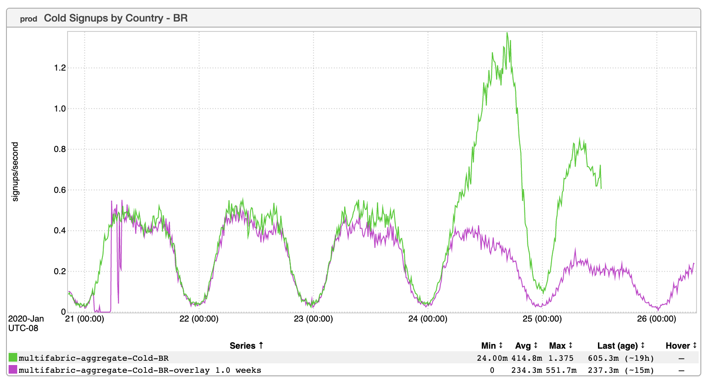

+++
title = "O Que é Tinder"
date = "2020-01-30"
slug = "o-que-e-tinder"
draft = false
+++

[Around the time I started at LinkedIn (September 2013) Conan O’Brien decided that he was going to conquer LinkedIn. This resulted in some ](https://www.youtube.com/watch?v=cinb5tcRYXw) consternation on our end as metrics like cold signups and connection requests suddenly showed unexpected spikes. I couldn’t find a GCN for this event [(although I did find an old ticket for Conan’s subsequent first post as an Influencer) and I don’t have any inGraphs for it, but I reckon the metrics probably ](https://jira01.corp.linkedin.com:8443/browse/APPOPS-26284) looked a little like the following:

The astute reader will note that this recent inGraph is specific to Brazil. The most significant movement of Brazil metrics I can recall was also pretty close to when I started at LinkedIn (June 2014). BizOps actually put together some estimates for the drops in traffic that we were likely to see during the opening ceremony and first game of the 2014 FIFA World Cup, but they forgot to take a few important data points into account; specifically, that the Cup was being played *in Brazil* that year, that the opening game was being played *by Brazil*, and...well...a fellow SRE put it better than I ever could: “There are two things Brazilians like to do: play futbol and click on LinkedIn”.

...but I digress. I’m talking about the Good Ol’ Days when we could be talking about what caused the signup increase pictured above. There is _an excellent _ _write-up on it_ so I won’t dive into too much detail here, but the tl;dr: the [Dolly Parton challenge](https://time.com/5770992/dolly-parton-challenge/). That’s right, folks...a viral meme caused a GCN.

Neat!
