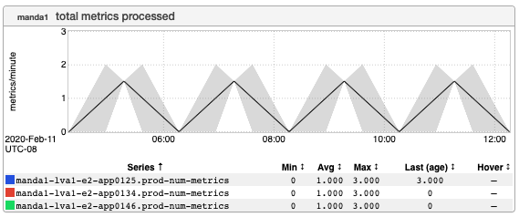
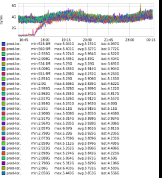
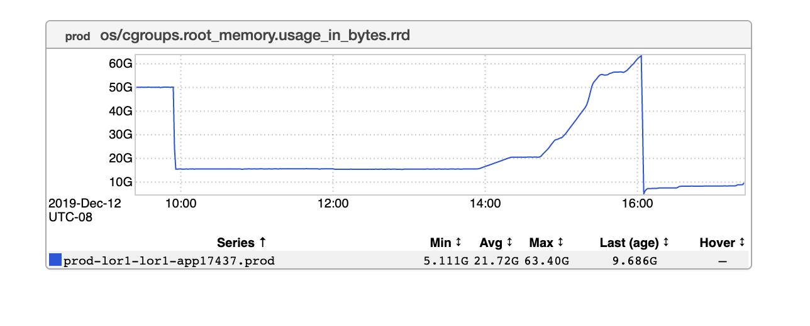
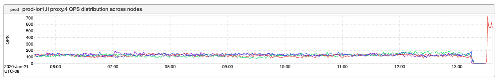
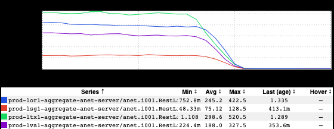

+++
title = "Unintentional Art (First Day of Spring"
date = "2020-03-20"
slug = "unintentional-art-first-day-of-spring-edition"
draft = false
+++

**Edition)**

[*Thank you to the folks who contributed to last week’s experiment On Toil*](/igotw/2020-03-13-on-toil/) *(go/ontoil)! I’m letting it percolate for a bit for now; I’m going to try and tease out* *some themes and pull it into something coherent Soon. :-)*

Just a few bits 'n' bobs from my backlog of ingraphs.

_Here's a nifty one that Minhaz Mahmud_pointed out. If memory serves I believe it's demonstrating the Median feature? ...but mostly I just like its unique aesthetic:

This next one is from _Karrick McDermottand is demonstrating a RHEL7 migration. Note the new nodes coming in and starting to Do Stuff:_

This next one I just named "aparsons-broke-it.png". Knowing _Allan Parsons_I'm *certain* he broke it...but damned if I can remember what "it" was:

_I did a little better with this one that Chris Carini_[ sent me, giving it the filename "ccarini-gcn-31628.png". According to the GCN](https://jira01.corp.linkedin.com:8443/browse/GCN-31628) all four of these nodes were patched and rebooted at the same time, and looking at the inGraph it would appear that only one of them was brought back online after the fact. (Presumably the rest followed in short order.)

_...and finally, a groups source-of-truth migration inGraph sent along by Alexsandra McMahan . Look at that convergence down to zero QPS. Just lovely. _

Happy (belated) first day of Spring, and happy inDay, folks!
