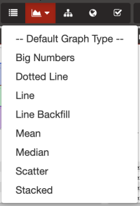
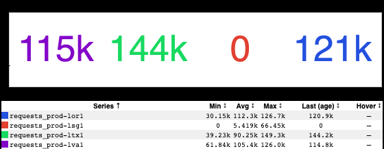
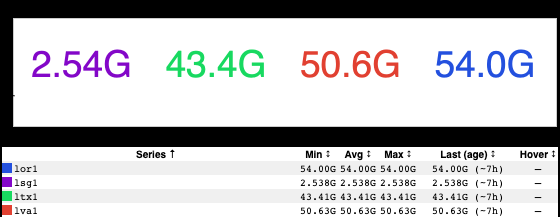
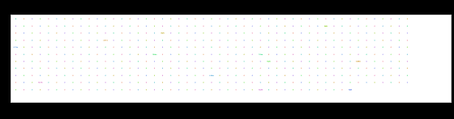

+++
title = "Big Numbers"
date = "2020-04-03"
slug = "big-numbers"
draft = false
+++

_Richard Waid recently pointed out a new inGraphs graph type to me: Big Numbers. Here's how you get to it:_

...and here's what it looks like:

This is the Big Number view of main partition requests to the site ([https://ingraphs.prod.linkedin.com/dashboard/stickyrouting/graph/main%20partition%](https://ingraphs.prod.linkedin.com/dashboard/stickyrouting/graph/main%20partition%20requests%20per%20fabric?fabric_groups=prod) [20requests%20per%20fabric?fabric_groups=prod), and the numbers being displayed are the "Last" value - the most recent available data point.](https://ingraphs.prod.linkedin.com/dashboard/stickyrouting/graph/main%20partition%20requests%20per%20fabric?fabric_groups=prod)

How might this be useful? Well, suppose for that same graph you wanted to compute the total number of queries in that time period. You could either do the arithmetic yourself, *or* you could leverage an RPN with the SUM [VDEF function](https://git.corp.linkedin.com:1367/plugins/gitiles/sre-infra/gorpn#vdef-functions):

- title: main partition requests per fabric defs: - range: "%%pop-l0proxy" rrd: ats/plugin.stickyrouting.requests_routed_to_prod-lor1_count.rrd label: requests_prod-lor1 - range: "%%pop-l0proxy" rrd: ats/plugin.stickyrouting.requests_routed_to_prod-lsg1_count.rrd label: requests_prod-lsg1 - range: "%%pop-l0proxy" rrd: ats/plugin.stickyrouting.requests_routed_to_prod-ltx1_count.rrd label: requests_prod-ltx1 - range: "%%pop-l0proxy" rrd: ats/plugin.stickyrouting.requests_routed_to_prod-lva1_count.rrd label: requests_prod-lva1 params: label_trim: true multifabric: true stack: true lower_limit: 0 consolidate: Aggregate vlabel: requests/second notes: "Requests per fabric for main partition only, as seen by L0\n" raw-title: main partition requests per fabric RPN: - label: lor1 expression: "requests_prod-lor1,SUM" - label: lva1 expression: "requests_prod-lva1,SUM" - label: ltx1 expression: "requests_prod-ltx1,SUM" - label: lsg1 expression: "requests_prod-lsg1,SUM"

Which then produces:

Here's something I'm a little unclear on: the vlabel on this graph says "requests/second" (i.e., QPS), but the RRD names and the notes lead me to believe that this is reporting the raw count of incoming requests for each reporting period (i.e., queries per minute). If it's the latter, no additional arithmetic need be done; this is the total number of requests for this time window. If it's the former, then we need to multiply these numbers by 60 in order to get the total number of requests (for example, 100 QPS for 1 minute = 6000 queries total).

Anyhow, this is just one example; there are other ways in which it may be useful. Oh, and just for funsies, let's go look at what this does with an inGraph that has a whole bunch of different series in it just for funsies:

Hey, look! A new graph type: Little Numbers!
