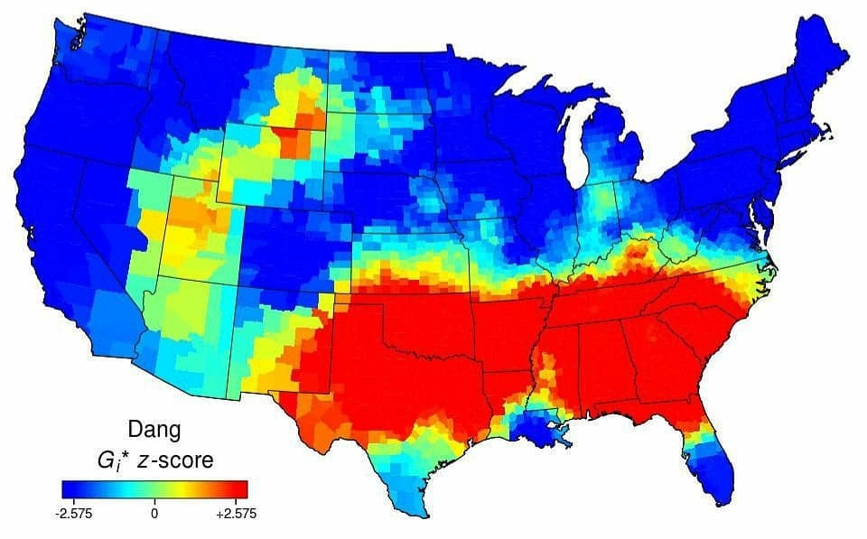
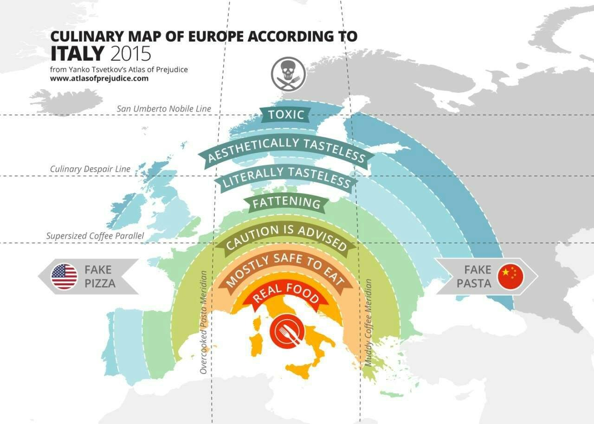
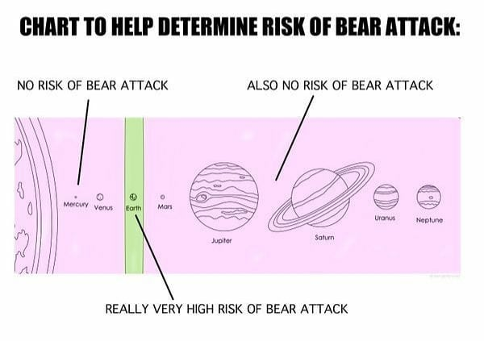

+++
title = "Cartography"
date = "2020-05-01"
slug = "cartography"
draft = false
+++

I recently stumbled across [Terrible Maps on Facebook. I have some interest in data viz and ](https://www.facebook.com/TerribleMaps/)[cartography is one of its oldest forms, so finding this led me ](https://en.wikipedia.org/wiki/Cartography) down a Sunday afternoon rabbithole poking through photos. Some of them are, in fact, terrible (as advertised). Some are actually pretty interesting. On the whole, though, I’d say the overall flavor of the page is “mild amusement”.

For example, this heatmap of the usage of the word “dang” across the United States:

...or this culinary map of Europe (according to Italy):

The maps on display here aren’t limited to terrestrial geography. According to Wikipedia “[the earliest maps known are of the heavens](https://en.wikipedia.org/wiki/Map)”, and in holding with that ancient tradition I present to you this (handy!) chart of our solar system:

Happy Friday, folks.
