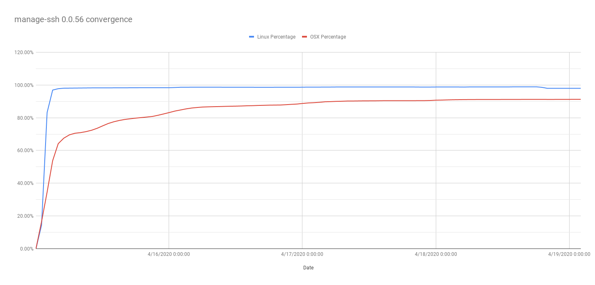
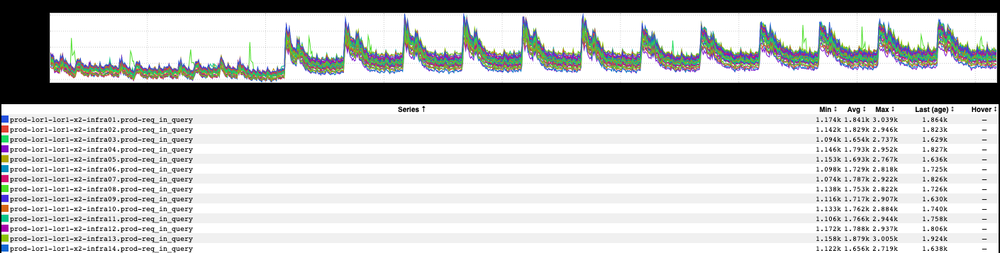
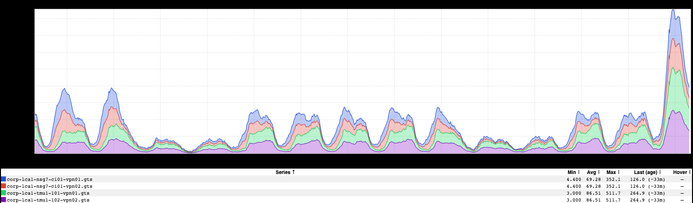
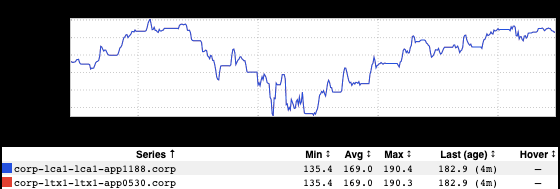

+++
title = "Unintentional Art (May 2020)"
date = "2020-05-22"
slug = "unintentional-art-may-2020"
draft = false
+++

This week's post is just a few bits 'n' bobs from my graph stash.

First up, a graph that _Luke Young__ put together to visualize deployment convergence of managed SSH configs_:

_Then there's this wonderfully-oscillating inGraph of inbound DNS queries from Ryan Underwood_. Possible theory: some batch job that spins up at the top of every hour and starts making calls?

_Next is one that I meant to post ~2 months ago...and completely forgot until today (sorry, Vishnu C N_). This is how APAC/India VPN sessions spiked up on the first day of mandatory WFH for the Bangalore office:

...and, finally, one that I've been intentionally holding off on posting until it recovered a bit: an inGraph of [MSFT share price](https://ingraphs.prod.linkedin.com/container/zorg/graph/zorg/stock-MSFT.rrd?fabric_groups=corp&filter=stock-&duration_amount=4&duration_unit=months). I'm not sure who owns whatever bit of machinery is producing this metric, but IIRC it was _Vadim Nosovsky who first pointed it out to me:_

***Bonus!*** *I stumbled across this video of the hot dog toaster* *I bought for my kids that I thought y'all might enjoy.*
