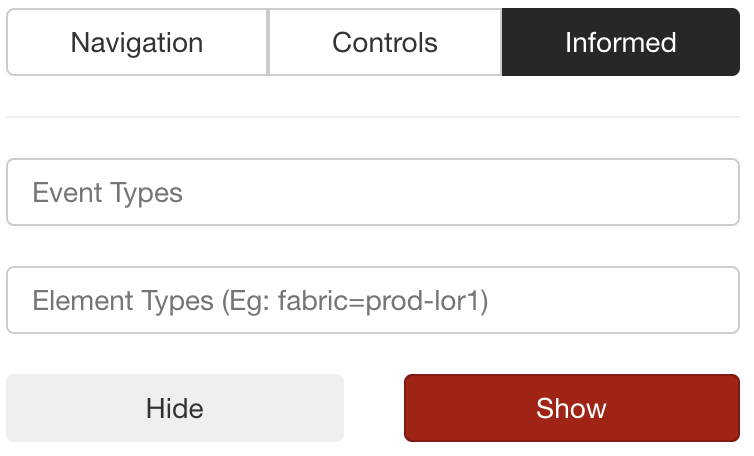
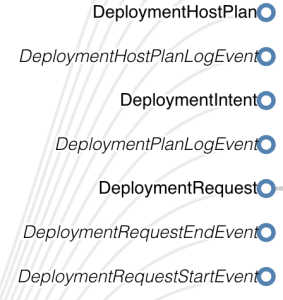
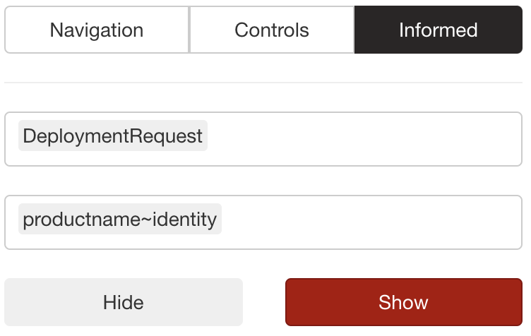
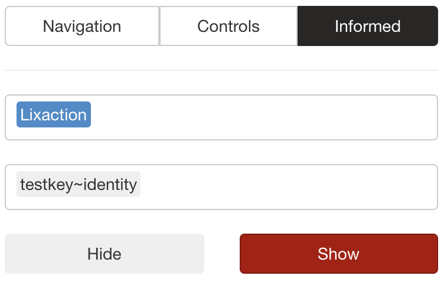

+++
title = "Informed Overlay Redux"
date = "2020-07-02"
slug = "informed-overlay-redux"
draft = false
+++

[The loyal reader might recall a post I did a few years back about how to use the Informed Overlay. Now that inGraphs has cut over to ](/igotw/2017-07-28-informed-overlay/)[inFormed v2 I ](https://informed2.corp.linkedin.com/) thought it might be worth revisiting and talking a bit about what's changed. Let's dig into it a bit and take a look at a couple of examples that I think might help folks out for common use cases.

Let's start off with what the new overlay UX looks like:

This looks similar, with a few key differences. Before there was a "Keyword" field that would search across all categories. In this brave new v2 world you need to provide both the type of thing that you're looking for ("Event Type") *and* the specific subfield ("Element Type") of that event. These fields autocomplete and there is a [schema explorer](https://informed2.corp.linkedin.com/#/schema/explorer/events) for poking around at what the various Events/Elements are. Fair warning: it's a collection of strings without a whole lot of information about what they actually mean.

For example, suppose we want to know whether deployment activity aligns with an inflection point in our inGraph. Taking a peek at the explorer:

There are 7 Event Types that start with "Deployment" (9 total that have "Deployment" somewhere in the name). The italicized ones have been deprecated, so I reckon we're down to three. Which one do we want? Well, let's give "DeploymentRequest" a shot. Supposing we want to limit the scope of the overlay to products with "identity" in the name, the search might look like this:

From a performance perspective this feels pretty "snappy" - click "Show" and the vertical bars show up almost immediately. If you want to see what the specific events are the UX works in exactly the same way as it did before; Ctrl-Drag over the time window you want to see and a modal will pop up listing them out.

Another common use-case: does some lix activation align with an inflection point in the inGraph(s) I'm looking at. This one has a shorter process of elimination - there's only one Event Type with "lix" in it. Supposing you want to look for any lix activity with the string "identity" in the name of the key, this should do the trick:

Anyhow...I hope this is helpful for folks trying to navigate how the new informed overlay works.

Happy Fourth, folks!
