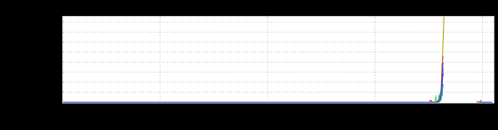
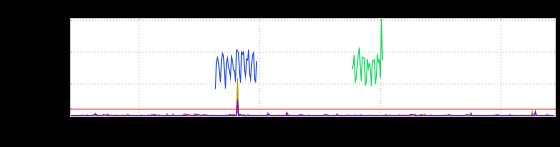
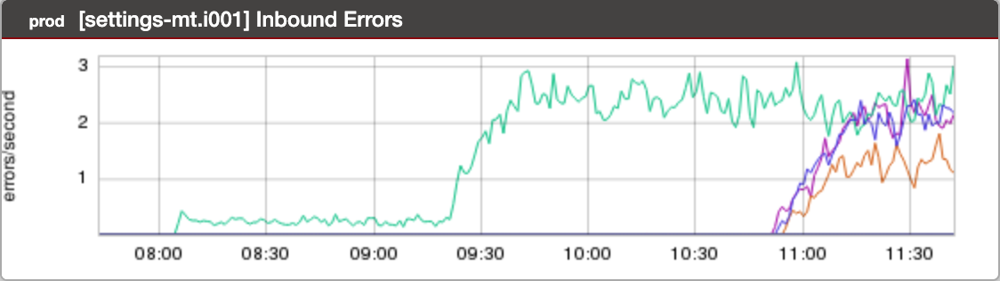

+++
title = "Unintentional Art (July 2020)"
date = "2020-07-17"
slug = "unintentional-art-july-2020"
draft = false
+++

I wanted to find something a little "light" to post today - it's the week after break, let's ease into it, shall we? So I was trolling through my inGraphs backlog and was a little surprised to discover that I haven't saved off anything new since around the April/May timeframe.

Not to worry! GCNs are typically a treasure trove of rad inGraphs, right? So I cracked open _go/ds3dash_ and immediately stumbled upon a couple of gems.

From GCN-33177:

Hoo boy. That's some kinda steep jump, eh?

...and from GCN-33173:

This one looks like a radio tower broadcasting some kind of a short-range signal. Or...well...maybe Dora the Explorer in a blue wig talking to a snake hanging out of a tree?

...and then there's this lil guy:

This didn't actually come from today's DS3 dashboard; it's one that I saved off last September (and promptly forgot about). I decided to throw it in because [it reminded me of the very first igotw post](/igotw/2016-01-07-not-learning-from-mistakes/). It tells a very similar story. Busted canary is deployed (in one fabric) just after 08:00, busted canary is promoted (in one fabric) just before 09:30...and then gets promoted in the remaining fabrics just before 11:00.

Everything old is new again, mmm?
