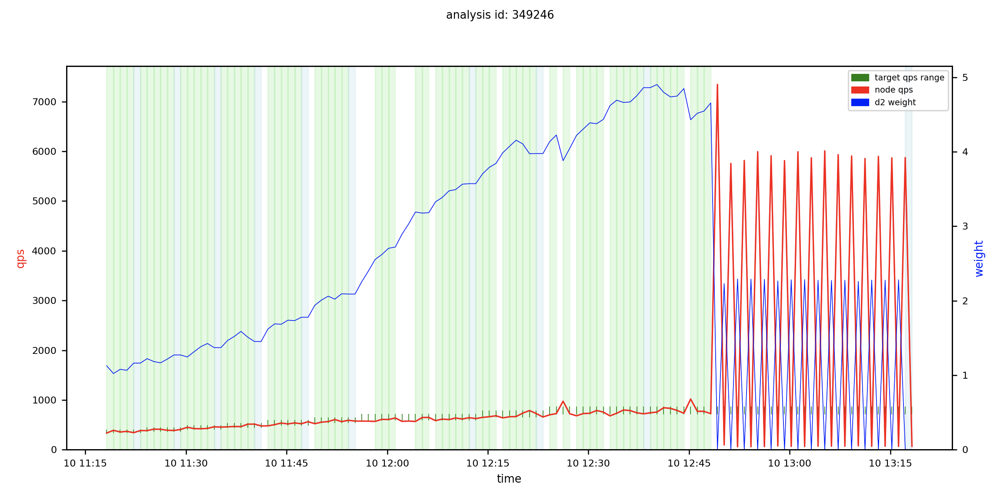
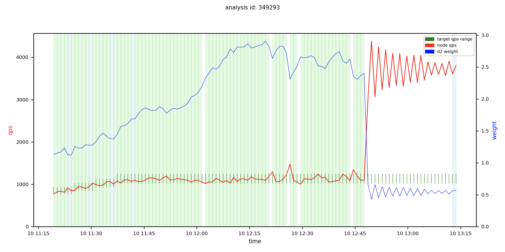
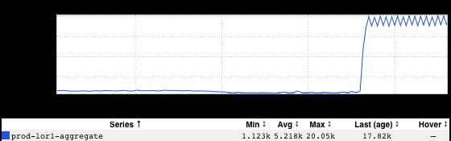
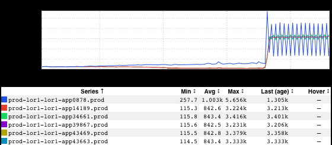
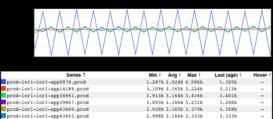

+++
title = "Oscillation"
date = "2020-08-14"
slug = "oscillation"
draft = false
+++

Earlier this week _Brandon Matthews_posted these two beaut's in #sre:

Oh man. I was curious, so I thought I'd do a little digging into the first one and see what I could see. I didn't (and still don't) know exactly where these graphs came from, but I took an educated guess that they were graphs of redliner runs based on the legends.

$ redliner test show 349246

Product: espresso-router Application: espresso-router Fabric: prod-lor1 Application Version: 2019.66.5 Controller: PID

Hostname: lor1-app0878.prod.linkedin.com Slice ID: 25ecefc9-bb56-4c07-ab31-f1eb8dd97caf Product Tag: ROUTER_JHUBBUB

Owner: ramehrot Schedule ID: 5271

Status: COMPLETED Result: Completed Test - Failed to Hold QPS Details: PidAnalysis 349246 ending due to PIDStep 199373 never settling Redline QPS: --

Action      State     Result           Target QPS  Start                    End                      Health Check ----------  --------  -------------  ------------  -----------------------  ----------------------- ---------------------- INCREASING  FINISHED  AGED                   368   2020-08-10 11:03:39 PDT  2020-08-10 11:23:12 PDT  http://go /ecu%20349246 INCREASING  FINISHED  AGED                   405   2020-08-10 11:23:12 PDT  2020-08-10 11:29:12 PDT  http://go /ecu%20349246 INCREASING  FINISHED  AGED                   446   2020-08-10 11:29:12 PDT  2020-08-10 11:35:12 PDT  http://go /ecu%20349246 INCREASING  FINISHED  AGED                   491   2020-08-10 11:35:12 PDT  2020-08-10 11:41:12 PDT  http://go /ecu%20349246 INCREASING  FINISHED  AGED                   540   2020-08-10 11:41:12 PDT  2020-08-10 11:48:12 PDT  http://go /ecu%20349246 INCREASING  FINISHED  AGED                   594   2020-08-10 11:48:12 PDT  2020-08-10 11:55:12 PDT  http://go /ecu%20349246 INCREASING  FINISHED  AGED                   653   2020-08-10 11:55:12 PDT  2020-08-10 12:13:12 PDT  http://go /ecu%20349246 INCREASING  FINISHED  AGED                   718   2020-08-10 12:13:12 PDT  2020-08-10 12:23:13 PDT  http://go /ecu%20349246 INCREASING  FINISHED  AGED                   790   2020-08-10 12:23:13 PDT  2020-08-10 12:39:13 PDT  http://go /ecu%20349246 DECREASING  FINISHED  NEVER_SETTLED          790   2020-08-10 12:39:13 PDT  2020-08-10 13:18:14 PDT  http://go /ecu%20349246

The _go links caught my eye so I thought I'd continue the hunt there. They didn't disappoint._

Okay, so it wasn't just that one node - the QPS for the entire service drastically increased during the redliner run. Interesting. Let's get rid of aggregation and see what we're working with:

Huh. An increase in QPS, sure...but still, just that one node was wilding out. Hold up a tick...Zoom...Enhance:

Oooooo. Pretty!

At this point the graphs were raising more questions than answers. Why is the "blue" node's d2 weight yo-yo'ing? Why is the "green" node picking up some - but not all - of the "slack" QPS-wise? ...and why *only* the "green" node? Why does this cause the entire service's QPS to oscillate? I mean, shouldn't it remain roughly constant irrespective of what any individual node's weighting is? Is that maybe an artifact of minutely metric reporting granularity? ...which leads me to wonder: what did the client(s) see during this time period?

...and then I figured maybe it was time to stick a pin in it and get back to my Day Job.
