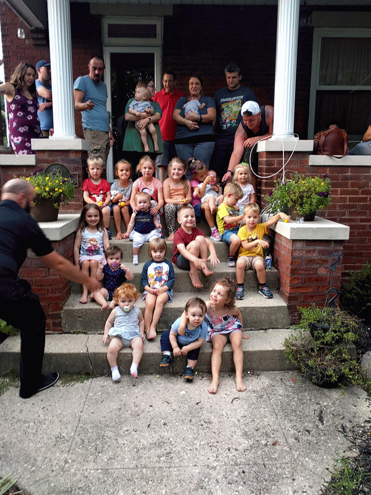

+++
title = "Family Night"
date = "2020-09-04"
slug = "family-night"
draft = false
+++

There’s a thing I do called Family Night. If you know me you’ve probably heard me talk about it and can safely skip the next paragraph or two.

Here’s how it works: Every Friday night I make a meal. A big meal. There is a standing open invite for family and friends, and anyone can come on any given Friday. Sometimes it’s just a dozen or so people - my mom and sisters (with husbands and kids) are the usual suspects. Sometimes it’s more like 20- 30 people. Peak Family Night was perhaps August 2018, around the time of my oldest daughter’s birthday; we had 39 people (20 adults, 19 kids). Here’s what that looked like:

That many people showing up is pretty rare...but when I say “open invite” I mean it, and when I say “every Friday night” I mean *every* Friday night. I plan my life around being home to make dinner for whoever shows up. In 2018 we did Family Night 49 out of 52 Fridays (there were a couple of weeks when we were out of town on DTO, and one week when *everyone* was sick.) A couple of times it’s come down to the wire - get off the plane, get a ride home, and get started making dinner.

For me, one of the hardest things about The ‘Vid has been putting Family Night on pause. We’ve done a handful of “limited engagement social-distancing get-togethers” over the past 6 months or so - and those have been awesome! - but it’s not quite the same thing as being consistently able to look forward to Friday nights. We’re also a decidedly hug-y bunch, and...well...that’s gone right out the window.

For the first couple of months of shelter-in-place I didn’t bother cooking anything on Friday nights, but I’ve gotten back on that horse (on a smaller scale). This has meant re-learning how to cook, to an extent. It’s a little like Fezzik’s line from The Princess Bride, right? You use “different moves” when you’re feeding a dozen people than when you’re only feeding four. I don’t get to see as many people...but I still get to cook, I still get to feed my family. And for a little more perspective: this isn’t the first Family Night hiatus. When we moved to the Bay Area all of our People were 2500 miles away, so for ~3.5 years we just didn’t do it.

Anyhow, I’ve got to go check on dinner - we’re having chili!

Happy Friday, folks.
