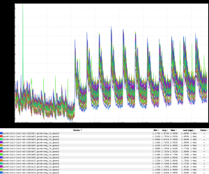
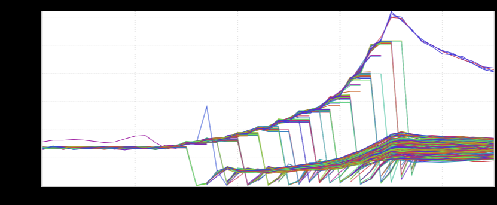

+++
title = "Unintentional Art (September 2020)"
date = "2020-09-11"
slug = "unintentional-art-september-2020"
draft = false
+++

[This week I've just got a few bits 'n' bobs that folks sent my way. First up, a nice little escalator to nowhere, courtesy of](/igotw/2017-03-02-escalator-to-and-from-nowhere/)_Nick Brown:_

_Next up is this great example of the Tighten Up from __Anthony Gargiulo_:

_Then there's this cool little oscillator that Ryan Underwood_sent my way:

...and last but not least, this praying mantis (with *entirely* too many legs), pointed out by _Brandon Matthews_:

Happy Friday...y'all stay safe out there.
