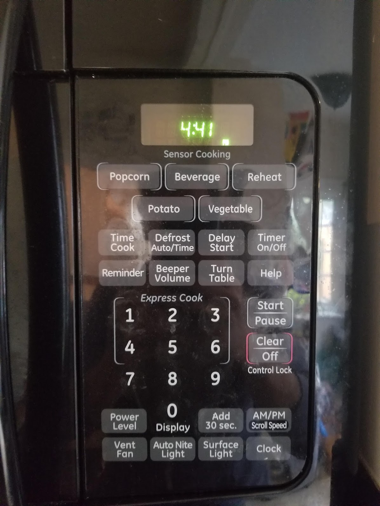
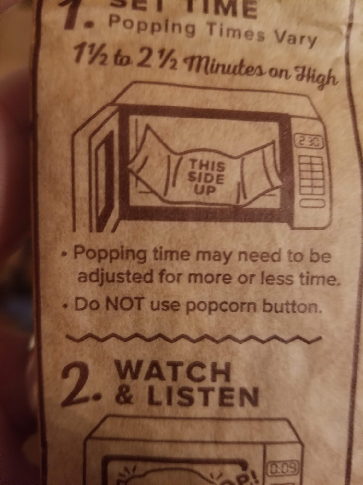

+++
title = "On Buttons"
date = "2020-09-17"
slug = "on-buttons"
draft = false
+++

[I was making dinner last week when the microwave button panel caught my eye. It was a bit of a Seth Godin “This Is Broken](https://www.ted.com/talks/seth_godin_this_is_broken)” moment; to wit: why on *Earth* are there so many buttons on this thing?

I started scrutinizing.

So far as I'm concerned this could all be replaced by one big "Add 30 sec" button. ("Add 30 seconds" is the single greatest innovation in microwave technology mankind has ever seen.) I guess I can also understand the numbers and the Time Cook/Start/Clear for those "old-school" microwavers. ...but let's take a peek at a few of the others, shall we?

**Power Level:** Has any anyone in the history of microwavedom ever adjusted the power level of a microwave? **Reminder:** I've never pushed it, but making a few assumptions about what its use case might be: how is it different from **Timer**? **Help:** How could it possibly? **Potato:** This is where I really lost my mind. A dedicated Potato button. *Are you shitting me?* **Popcorn:** Aha! Now we're getting somewhere - this is a button I could legitimately imagine actually using! ...except, as my wife pointed out "Yeah, but every bag of popcorn you ever buy will tell you right in the directions *not* to use the Popcorn button."

Huh.

This all put me in mind of one of my favorite bits of *nix minutiae. Real quick: open up a terminal and give this a shot:

ls -Satan -is -a -llama

The output will be damn near inscrutable...but it works!

How many things can you think of that have "too many buttons"?
