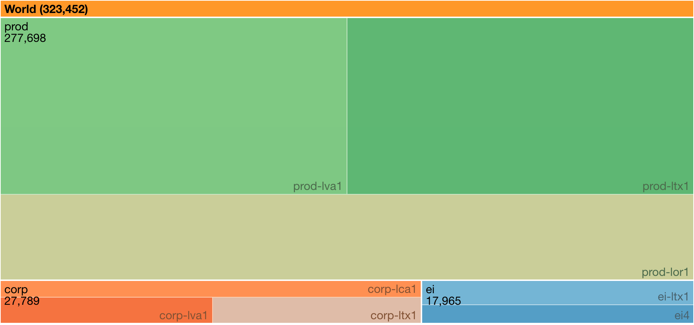
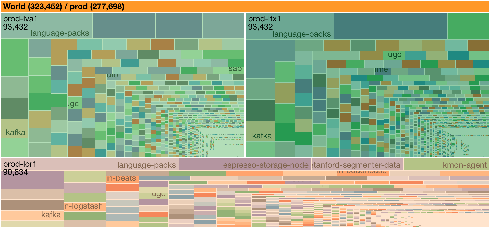

+++
title = "Footprint"
date = "2020-09-25"
slug = "footprint"
draft = false
+++

[A while back someone asked me a question about server footprints. It kinda stuck with me, so last inDay I spent an hour or two fiddling around with d3js ](http://bl.ocks.org/ganeshv/6a8e9ada3ab7f2d88022) [treemaps and came up with this:](http://bl.ocks.org/ganeshv/6a8e9ada3ab7f2d88022)

It's kinda slick in that you can click into a given environment and get a breakdown:

...but it gets pretty illegible pretty quickly outside of the top few things installed. Clicking into an individual fabric:

I don't know how useful it is in this state, but it really is quite lovely. It could probably be further refined with some filtering/thresholding, and it might be cool to have it show how footprint has changed over time...but that's a project for another (in)day.

Anyhow, if you wanna play around with the code I stuffed it into git:

[https://git.corp.linkedin.com:1367/plugins/gitiles/csnyder/hacks/+/master/footprint/](https://git.corp.linkedin.com:1367/plugins/gitiles/csnyder/hacks/+/master/footprint/)

Or if you're just interested in clicking around on a working copy:

_http://csnyder-ld2.linkedin.biz/footprint/_

(Fair warning: it's just running on my desktop so it could go away at any time...)

Happy fiddling!
