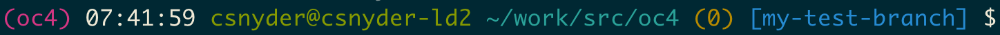
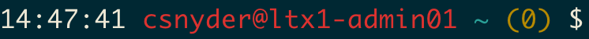

+++
title = "Fun with PS1"
date = "2020-10-02"
slug = "fun-with-ps1"
draft = false
+++

My .bashrc tends to be a slow-moving beast; other than the occasional new tool requiring a **FOO_HOME** variable it's pretty much "set-it-and-forget-it". But once every coupla-few years I get the "itch" to fiddle with it and see what I can improve. Last week was one such time.

There are a few things I wanted to get out of my PS1 - the variable that determines what my bash prompt looks like.

1. I wanted it to be more legible. It was full of gnarly ANSI escape sequences like **\[\033[01;32m\]**that I have to look up any time I want to understand them.

2. I wanted it to be a little bit "smarter" about Python virtualenvs. Activating a venv typically prepends a "(venv)" to your prompt...but what about when I have multiple terminal tabs open with different venvs activated in them?

3. I wanted it to show me what git branch I happen to be on (if I'm in a git repo), and I wanted it to let me know whether my working copy was "clean".

4. I wanted it to give me some visual indicator of what environment I was in.

After a bit of googling and an hour or two of bashing I think I've got it about where I want it. Behold!

I went ahead committed what I did [here](https://git.corp.linkedin.com:1367/plugins/gitiles/csnyder/hacks/+/master/snippets/ps1.bash) in case you're interested in the details, but I'll step through each of these bits:

1. **(oc4)** - I have the venv for the oc4 MP activated.

2. **07:24:37 csnyder@csnyder-ld2 ~work/src/oc4** - The "standard" stuff here - current time, user, hostname, and working directory.

3. **(0)** - The number of backgrounded jobs (I started including this in my prompt *years* ago when I found myself constantly running jobs to figure out how many instances of emacs I had backgrounded and subsequently forgotten about).

4. **[master]** - The git branch I'm on (in this screenshot, working copy is clean).

Demonstrating a couple of the git features, here's what it looks like when I check out a different branch:

...and when that branch contains uncommitted modifications:

Here's what it looks like signed into hosts in different environments:

EI:

corp:

prod:

Sorted. Now, it's time to get back to work.

[*Code available in git here: https://git.corp.linkedin.com:1367/plugins/gitiles/csnyder/hacks/+/master/snippets/ps1.bash*](https://git.corp.linkedin.com:1367/plugins/gitiles/csnyder/hacks/+/master/snippets/ps1.bash)
