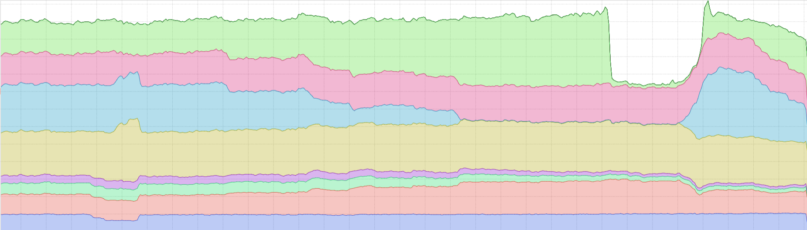
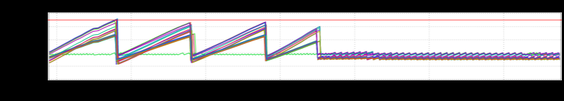

+++
title = "Quarter-Millennial"
date = "2020-10-08"
slug = "quarter-millennial"
draft = false
+++

This is the 250th inGraph of the Week. To commemorate the "occasion" I thought I might revisit every 50th post, from the beginning....perhaps with a little color commentary (not just a link-dump - I'm a little more loquacious than that). So let's see what we're working with here...

**Post #1:** _**inGraph of the Week - (Not) Learning from Mistakes (1/7/2016)**_

The inaugural igotw is one of my all-time favorites. I've referenced it in multiple other posts and it continues to be relevant nearly 5 years later. It's a bit of a throwback to the Bad Old Days when canary promotions were a matter of "canary your code, go look at every inGraph and log file in existence, and if you don't see anything that looks any different than before then you're *probably* okay to promote". Things are Better Now (tm) - better guardrails, more automation around canary signal, etc. - but busted canaries still get promoted to this day. I suspect they always will...just hopefully with decreasing frequency, yeah?

_**Post #50: inGraph of the Week - Stacked Graphs**_ **(12/8/2016)**

Also still relevant years later. I still have a hate/hate relationship with stacked graphs. I still want people who rely on stacked graphs of latency metrics to _seek professional help. I'm back living in Ohio again...and I suspect Kathleen Shannon would still be kinda mean about it. Everything Old is New Again._

_**Post #100: inGraph of the Week - Cubism**_ **(11/17/2017*****)**

I'm diverging a bit from the "every 50th post" format here, simply because _the _*actual* _100th post_ was kind of a lame "Happy Thanksgiving" post. The week [prior to that was a little more interesting - some experimental work around some cubism data viz stuff I happened to be playing with at the time. I've since ](https://square.github.io/cubism/) mothballed that code (in fact cubism itself has been mothballed), but I like how it explored some interesting possibilities.

_**Post #150: inGraph of the Week - Flatline Redux (11/9/2018)**_

This made me think that I should get back to doing "Pattern" posts. I haven't done one in a while, but the general idea is to showcase patterns that you either do (or, more often, *don't*) want to see in your inGraphs.

_**Post #200: inGraph of the Week - Keepin’ It 200**_ **(10/25/2019)**

Perhaps unsurprisingly, the 200th post was a post about...well...about being the 200th post. The thing that stood out to me the most about this was the pair of posts bookending it:

The one that came before: _inGraph of the Week - On Mentorship_

_The one that came after: inGraph of the Week - SREs Are People, Too_

If you've ever written something you'll grok a certain kind of embarrassment when looking through the things you've written in the past. ...but if you write enough, every now and again you'll come across something you've previously written and think "Huh. That wasn't too bad." Maybe you'll even find some pieces that make you think "That was toly righteous and I'm actually proud I wrote it." For me, these two posts fall somewhere in that range.

I guess my point is this: navel-gazing aside (y'all are gazing into my navel t*his very moment!* **Write.** ): You'll be glad you did.
