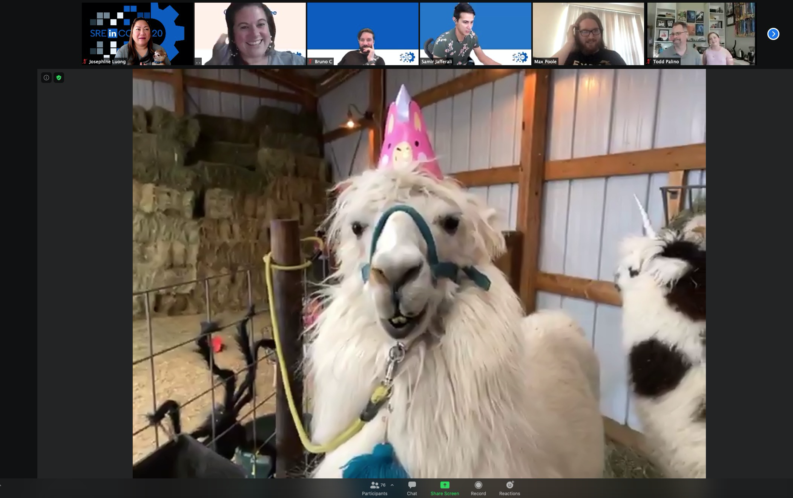

+++
title = "SRE[in]con 2020"
date = "2020-10-16"
slug = "sre-in-con-2020"
draft = false
+++

_Another successful incon_ wrapped up yesterday afternoon. The format was decidedly different this year - 100% virtual over Zoom webinar - but other than a couple of minor technology hiccups (and a swag shipping delay) I’d say it went off without a hitch and maintained the essential spirit of incons past.

As in previous years, the Fireside Chats stood out to me in particular.

**Fireside Chat #1**

**Who:**[ David Henke](https://www.linkedin.com/in/drhenke/), former SVP of Engineering/Operations at LinkedIn.

**What:** This chat was a bit of a trip down memory lane, covering some of Henke's career but mostly centered on the tenets and principles that he established in his time at LinkedIn.

**What I Liked About It:** I started at LinkedIn when Henke had one foot out the door, but it strikes me that the majority of the org never worked under him and perhaps have only ever heard his name in passing. This was a cool opportunity for folks to learn the history of how Site Up (among other things) came to be integral to LinkedIn's culture. Also, Henke apparently made a bet (with Igor, I think?) that he wouldn't say the f-word during his chat. (Fuck me, he won that bet!)

**What I Wish I Would've Asked:** I had a question about how Henke might have thought about continuing to evolve SRE if he'd decided to stick around a little longer before retiring (again), but I couldn't quite formulate the thing I was trying to ask in a succinct way. A bit of l'esprit d'escalier

here, but perhaps something like "The Site's Up, Mr. Henke. ...what now?" ...then again, maybe asking that would've caused him to lose his bet.

**Bonus:** Footage of [Henke playing Ring of Fire at DS3!](https://drive.google.com/file/d/1QWsbCwryess-Dns8dZGCy5stf7A_7kH3/view)

**Fireside Chat #2**

**Who:** [Erica Joy Baker, Director of Engineering at GitHub.](https://www.linkedin.com/in/ericajoy/)

**What:** This chat covered a pretty broad swath, including Erica's upbringing as a "military brat", DIBS topics (and how inclusion fundamentally *has* to start with Leadership), imposter syndrome, mental health & therapy...and probably a few others that I'm forgetting.

**What I Liked About It:** I feel kind of silly saying "everything", but this chat was super-engaging and I really enjoyed hearing Erica's perspective. I suppose if I had to pick one thing I might call out the bit about having a "smile file". This was a novel concept to me, but apparently it's a Thing - this idea of having a collection of things that you can turn to as a pick-me-up when you're feeling down. Imposter syndrome starts flaring up? Go dig around in your smile file and pull up the kudos email from that awesome thing you did that one time.

**What I Wish I Would've Asked:** There aren't any questions I wish I would've asked Erica, but I *do* wish I would've taken notes. This talk wasn't recorded, and I'm already "forgetting what I wish I would've remembered", so to speak.

**Bonus:** She referenced [Goofus and Gallant! That was an unexpected blast-from-the-past.](https://en.wikipedia.org/wiki/Goofus_and_Gallant)

I'm not going to dive into any of the other talks here, but I *do* [want to call out the social events. After Wednesday's sessions we used SpatialChat](https://spatial.chat/). This was a first for me and I have to admit being a bit bewildered until I figured out the core mechanic. You just move your "bubble" next to clusters of other peoples' bubbles to join the conversation, just like you might do at a cocktail party. Very cool.

...and the second day's social event: ***llamas!***

*Nuff said.*
