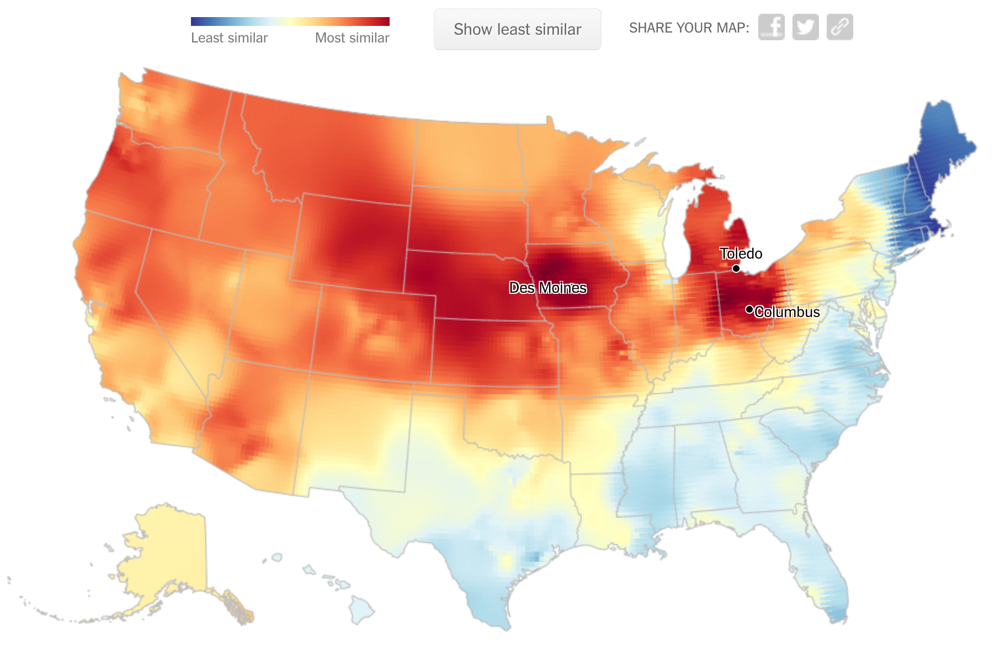

+++
title = "Red vs Blue"
date = "2020-11-05"
slug = "red-vs-blue"
draft = false
+++

I'd wager that most of the folks reading this have spent some amount of time looking at red/blue maps of the United States this week. Allow me to add a few bits of slightly different red & blue to the mix.

This is the map generated for me by a [dialect quiz that ](https://www.nytimes.com/interactive/2014/upshot/dialect-quiz-map.html)_Tyler Elliott recently sent my way. How it works: you answer a handful of questions about how you _ pronounce this-or-that word, and it spits out a heatmap showing you the regions of the country that you are most/least likely to have come from based on those pronunciations. It's based on data from research on regional dialects. This is my "most similar" map. Unfortunately, I didn't think to capture the link or the "least similar" map before I went on about my day, but...well...it's eerily-accurate.

[Alternatively, if you're into video-game-based sci-fi comedy, maybe this is more your speed](https://roosterteeth.com/series/red-vs-blue). *(Side note: Who remembers this? ...and who knew that they're* [*apparently still at it*](https://en.wikipedia.org/wiki/List_of_Red_vs._Blue_episodes#Season_18:_%22Zero%22_(2020))*?)*

...and finally, here's a pic I like to call "Red State, Blue Tongue":

In case you can't quite make it out, those shirts say "Future Voter".
