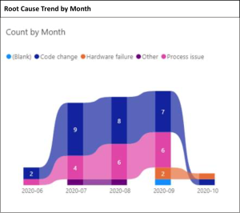
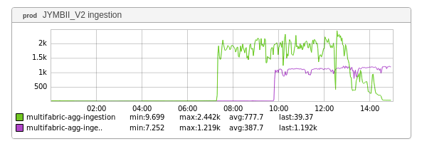

+++
title = "Unintentional Art (Elephant Edition)"
date = "2020-11-13"
slug = "unintentional-art-elephant-edition"
draft = false
+++

Recently _Ben Goldsbury_hit me up with this lil beaut':

It very clearly resembles an elephant, and it got me thinking: where have I seen something like this before? Oh, right! A _previous UA post_ that included "The Little Prince":

If that's not a picture of a snake swallowing an elephant then frankly I don't know what is.

...and then I was scrolling around my inGraph catalog and - lo and behold! - look what I found:

It's like a deconstructed minimalist version of the one bgoldsbu sent my way.

*Also worth honorable mention: inGraph of the Week - Patterns (The Dreaded Plateau)*

It's pachyderms all the way down.

Happy inDay, folks.
