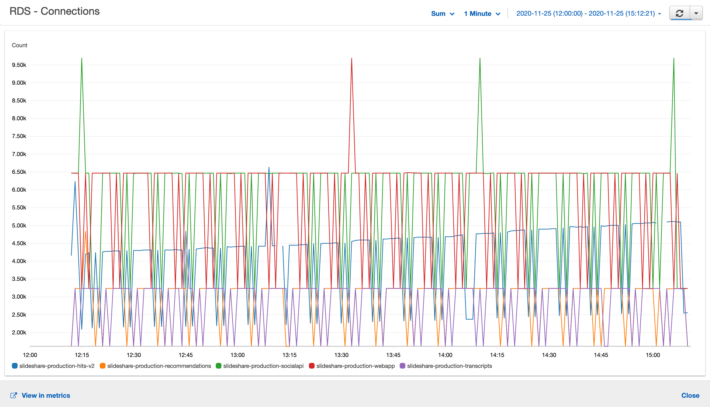

+++
title = "Black Friday"
date = "2020-12-04"
slug = "black-friday"
draft = false
+++

*2020-12-04 - I went to write the igotw today and realized that last week's post was missing. I looked around and apparently Confluence decided to publish* *it under* *Ada Ma**'s blog? Bizarre. Anyhow...in case you aren't on the email list, here it is...*

Folks, I gotta say this has easily been the weirdest Thanksgiving in memory. I made a buncha turkey and stuffing and mashed taters and green beans and gravy - that bit was more-or-less the same as usual.

...and then Mom came over and ate on the front porch.

...and we bought takeout containers so she could take some home (and take some to my sisters).

I mean, the whole thing was just fuckin' bizarre. Nearly surreal.

_Anyhow, working past that: we've got a little bit of lovely from Anthony Gargiulo_:

Imma choose to interpret this as Christmas trees, marching up-and-to-the-right.

So I reckon let's push on through.

C'mooooon Christmas - let's get outta this year and see what 2021 brings, mmm?
