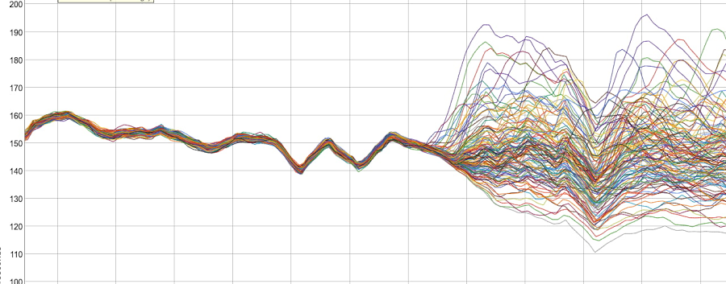
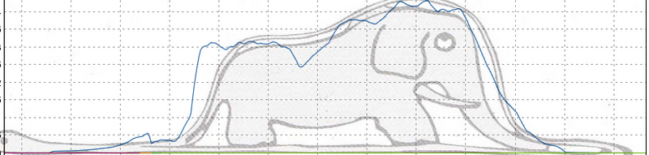

+++
title = "mobaa"
date = "2020-12-18"
slug = "mobaa"
draft = false
+++

Earlier this week a couple of folks brought a [recent post](https://cloud.google.com/blog/products/devops-sre/welcome-to-the-museum-of-modern-borgmon-art) about Google's [Museum of Borgmon Abstract Art](https://sre.google/mobaa/) to my attention. In the vein of "imitation is the sincerest form of flattery" let's take a peek at a couple of their graphs, shall we?

Their fraying tapestry graph...

[...made me think of prior posts](/igotw/2016-11-10-load-un-balancing/) about _load balancing_. It's also a good example of the inverse of the _Tighten Up._

But the one that *really* got me going was their "k8s elephant":

Holy crap, I *just* did a whole _Elephant UA post a month ago!_

_Samir Jafferaliwent so far as to say I should do an Eng Blog post with timestamps so they'd know I "came first"; welp, _[done and done.](https://engineering.linkedin.com/blog/2017/08/ingraphs--monitoring-and-unexpected-artwork)

I love this so much - that there are "birds of a feather" out there seeing the same kinds of things that I do, grokking the world in such a similar way. Very

cool.
