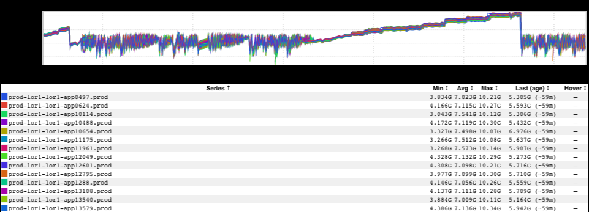

+++
title = "Pantsdrunk"
date = "2021-01-09"
slug = "pantsdrunk"
draft = false
+++

Maybe some of you have asked yourself questions about what service do during the year-end moratorium/company shutdown. Left alone to their own devices with nobody poking and prodding them, do they take the time to catch up on their reading lists? Do they reflect on the happenings of the past year and *auld lang syne*[? Perhaps a little Kalsarikännit? Well, this lil beaut' that ](https://www.pri.org/stories/2020-04-13/kalsarik-nnit-drinking-home-your-undies-finns)_Vishnu C Nsent my way might shed some light on the matter:_

Hoo boy...somebody call a plumber.

As it turns out, some services handle the holidays a little like people do - just consuming and consuming more and more until those New Years' resolutions

to "hit the gym" kick in.

[*Bonus: The NY Times 74 favorite facts of 2020* ](https://www.nytimes.com/2020/12/30/insider/74-of-our-favorite-facts-for-2020.html)[*Kalsarikännit*](https://www.pri.org/stories/2020-04-13/kalsarik-nnit-drinking-home-your-undies-finns)*.* [ *is #23.*](https://www.pri.org/stories/2020-04-13/kalsarik-nnit-drinking-home-your-undies-finns)
