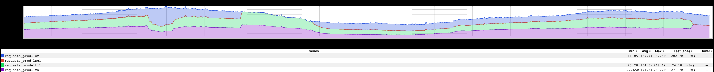
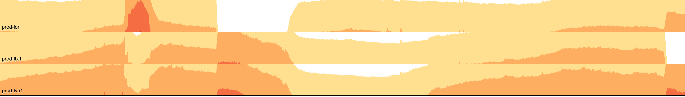

+++
title = "vizplay"
date = "2021-01-22"
slug = "vizplay"
draft = false
+++

Over the years I've played around with various bits of data viz. Sometimes it's a point solution for a bespoke problem space. Sometimes I want to see if I can compress as much data into as small a space as possible. Sometimes I just plain wanna make "something that looks cool" - *viz gratia artis*, if you will.

Unfortunately, I've done a completely awful job of keeping any of it organized.

These bits 'n' bobs are scattered across time, space, and hardware. Some have been committed somewhere-or-other and some have not. (Did I put that in my svn hacks directory? In my gitli hacks directory? Mebbe it's just sitting in /var/www/html on my Linux tower? Oh, or /tmp/do-the-damn-thing.py? ~/tmp? Hmmm...)

The Creator in me says "Don't stifle me with your 'Rules' about where and how to keep my Art", but my pragmatic side says "The fuck did I put that one thing I did three years ago? It'd be super-handy right about now."

[So. In the name of getting my shit together I went ahead and created vizplay last inDay - a multiproduct where I could start to stash some of these piece-](https://git.corp.linkedin.com:1367/plugins/gitiles/multiproducts/vizplay) parts and (hopefully) start to build upon and re-use some of them. *This* inDay, I decided to implement the simplest possible thing I could think of: re- _creating go/stickyrouting_ main partition inGraphs using d3js horizon charts.

The inGraph looks thus:

...and the vizplay version looks so:

Nifty. I dunno if this quite fits the "Dream Big" theme, but it wasn't a bad way to spend a few hours on an inDay.
