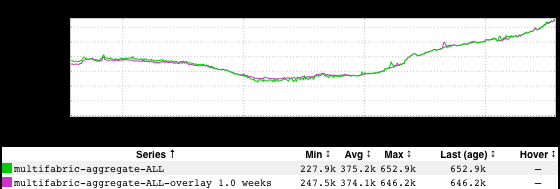
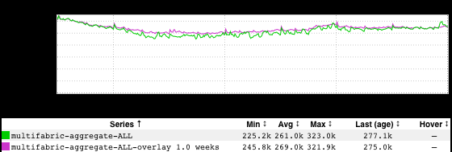
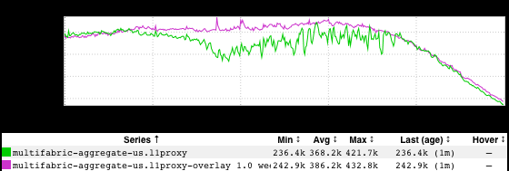

+++
title = "Superbowl LV"
date = "2021-02-12"
slug = "superbowl-lv"
draft = false
+++

[I've posted before](/igotw/2016-02-11-the-superbowl/) about the impact of world events - notably, the Superbowl - on site traffic. I thought I'd take another peek this year:

Huh. That really doesn't look like much. Maybe if I tighten up the window to align more closely with the time of the game?

Zoom. Enhance.

Still just minor perturbations - a blip on the radar, nowhere near the kind of impact we've seen in previous years.

At this point I started theorycrafting. Maybe nobody's really interested in seeing Brady pick up a seventh ring? Perhaps fewer people are going out to watch the game due to The 'Vid, and thus are more likely to be fiddling with social media on their phones while sitting on their couch than if they were at a bar socializing with other people?

Then, an epiphany: most of the world doesn't give a shit about the Superbowl; in years past I've looked at US (and Canada) traffic, specifically.

Ah, that's more like it. Mystery: solved.
