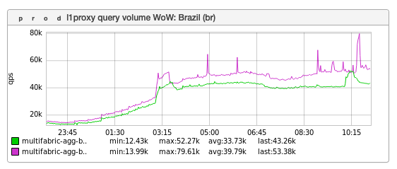
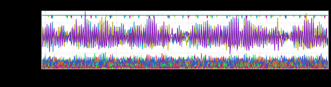
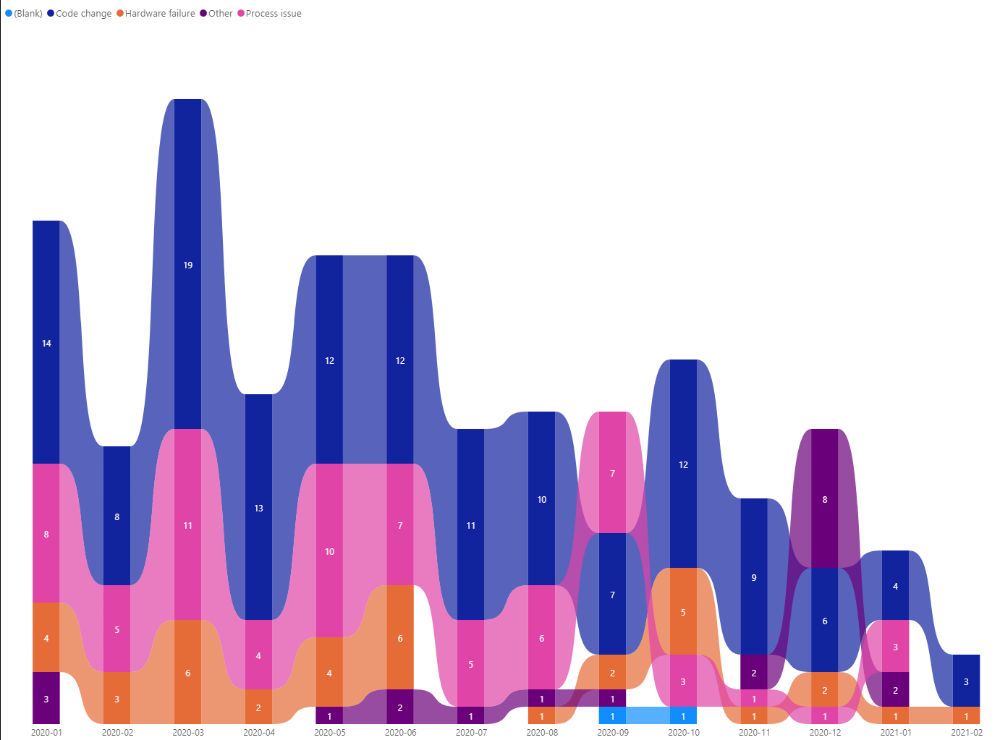

+++
title = "Unintentional Art (February 2021)"
date = "2021-02-19"
slug = "unintentional-art-february-2021"
draft = false
+++

[Last week I posted about the impact the Superbowl had on (US) site traffic. Welp, 'Murricans most certainly aren't the only ones who like a good party - ](/igotw/2021-02-12-superbowl-lv/) here's what the impact of [Carnival](https://en.wikipedia.org/wiki/Brazilian_Carnival) looks like:

The connection is a little thin here...but if you had to imagine what the music was like, maybe the equalizer would look something like this?

_...and utterly unrelated: elephants_ have come up [more than once](/igotw/2020-12-18-mobaa/) in this space. This GCN root cause graph reminds me of nothing so much as the [Pink ](https://www.youtube.com/watch?v=jcZUPDMXzJ8) [Elephants on Parade](https://www.youtube.com/watch?v=jcZUPDMXzJ8) scene from Dumbo. (My 8-year-old agrees).

Happy inDay, folks.
