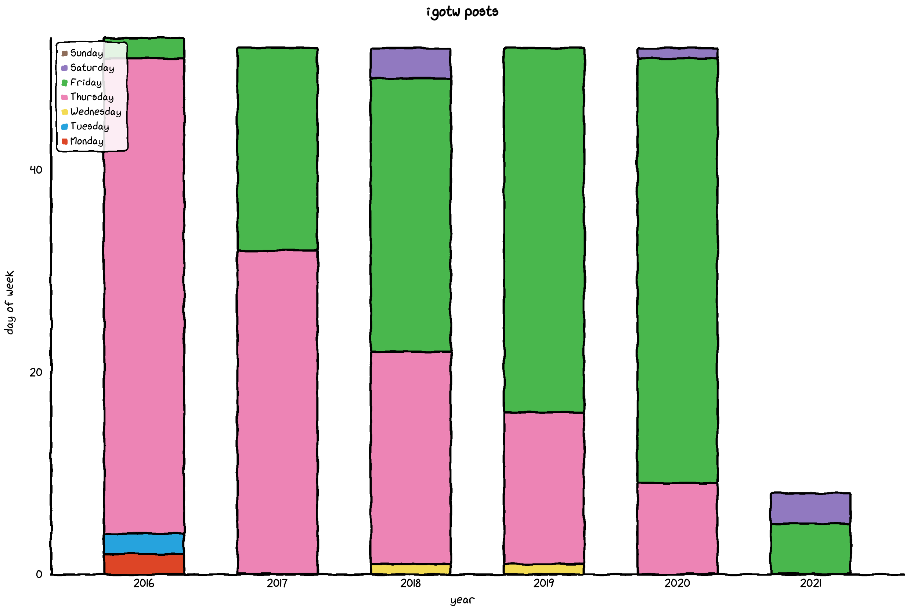
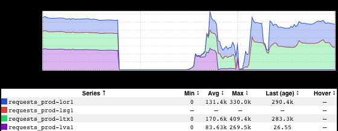

+++
title = "Frequency"
date = "2021-03-05"
slug = "frequency"
draft = false
+++

A little while back someone in some slack channel mentioned looking forward to igotw being posted on Fridays. "Nonsense", said I, "I make it a point to post every Thursday, and only spill over into Friday if something comes up and I end up being too busy." But then I started thinking about it, and I couldn't actually remember the last time I'd posted on a Thursday.

Time to look at the data.

Time...to [vizplay](/igotw/2021-01-22-vizplay/)!

Huh. Looks like I did pretty well sticking to Thursdays in 2016, and I've been slowly sliding into Friday and - yikes! - sometimes even Saturday ever since. ( [Clicky-clicky](http://lor1-0000279.int.linkedin.com:14557/static/xkcd/stacked-bar-chart.html)[ if you wanna fiddle with the chart. Oh, and bar charts](http://lor1-0000279.int.linkedin.com:14557/static/xkcd/bar-chart.html)[ and line charts](http://lor1-0000279.int.linkedin.com:14557/static/xkcd/line-chart.html) are a thing, too.)

Ah...and in case y'all missed [The Commapocalypse](https://jira01.corp.linkedin.com:8443/browse/GCN-34538), our site was hard down for about an hour earlier this week. Here's what that looked like:

Oof. Thanks to everyone who jumped in and got 'er back up-and-running.
