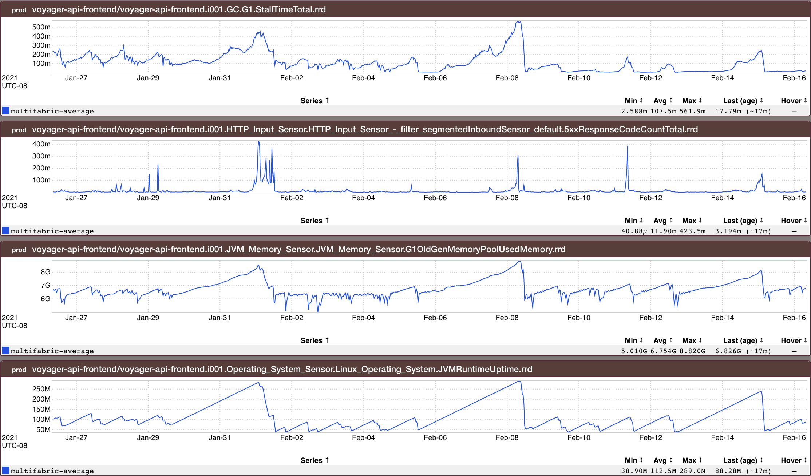

+++
title = "Leaks"
date = "2021-03-13"
slug = "leaks"
draft = false
+++

I've posted about leaks [several ](/igotw/2021-01-09-pantsdrunk/)[times ](/igotw/2017-04-13-go-routine-leak/)_in the past__ _. Let's take a look at another, shall we?

_This set of inGraphs tells a pretty good story (thanks Vishnu C N_!) - the longer the service is up, the more memory it consumes...either until someone comes in on Monday morning and deploys/restarts it,   it tops out, starts GCing and 5XXing. What was the cause? In vcn's own words "a cache to store *or* info about non critical endpoints for load shedding" (that was growing unbounded). What's that look like? Welp, vcn helped us out there, too:

One big fuckall hash with 29M items holding onto ~2.6GB of memory (and growing). _Look familiar_?
