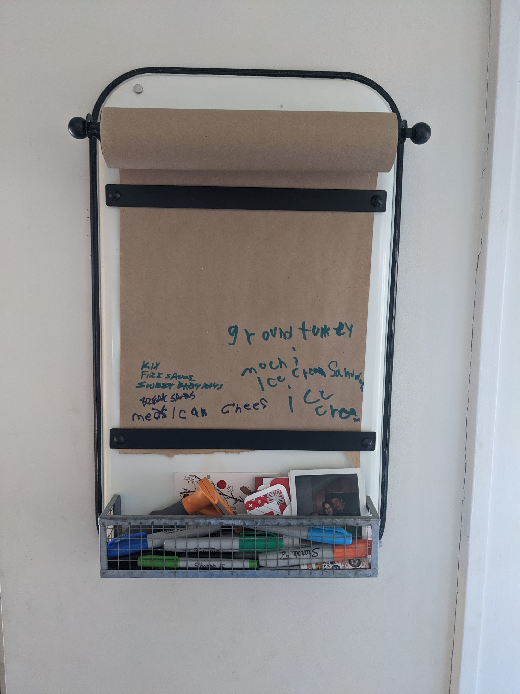

+++
title = "Learning"
date = "2021-03-26"
slug = "learning"
draft = false
+++

Folks with kids will sometimes talk about how their children teach them things. Patience, unconditional love, a renewed appreciation of "the smaller things in life" - that's the brand of claptrap they're usually talking about. That's fine, all those things are grand.

But check this out:

This photo contains a few subtle indicators that my children have been adding things to the grocery list. The suboptimal handwriting and spelling, the preponderance of ice cream and ice-cream-related products...and, crucially, the positioning of the text.

To wit: it's at the bottom. (The kids are short, they write where they can reach while standing on a step stool - makes total sense, right?)

So I'm standing in my kitchen one morning, sipping my first cup of coffee and glancing over the grocery list, and it dawns on me: *Why on* EARTH *have I* *been writing this list from the top down?*

For YEARS now that's how I've been doing it. Top-to-bottom, in columns left-to-right.

What do you do when you only have, say, a dozen things on there come time to go to the grocery? Rip the whole thing off? That's kind of a waste. Just cross off items after they're transferred to something more portable that I can carry around the grocery store? Sure, but now you've kinda got a bin-packing problem - I mean, what do you do if the page fills up before your next trip? (Man I wish I had an alternative pic with "toothpaste" scrawled vertically in the margins in 4-point font...)

My girls solved all this neatly in one fell swoop, by virtue of doing the most-natural possible thing.

Here's the thing: *I started doing it too!* Before even *realizing* I was doing it, or why. I added Kix, Fire Sauce, et al to the list. I put it next to the kids' ice cream "because that's where stuff has already been written"...and all of this *before* having my Moment of Profundity with my morning coffee.

*“A leader is best when people barely know she exists, when her work is done, her aim fulfilled, they will say: we did it ourselves.” – Lao Tzu*

Just sayin.
