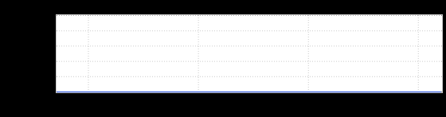

+++
title = "RestUp!"
date = "2021-04-09"
slug = "restup"
draft = false
+++

It's been a few years since I posted _Boring inGraphs, but I thought in honor of _[RestUp! Week it might be appropriate to drop something like this error rate ](https://economictimes.indiatimes.com/magazines/panache/restup-linkedin-giving-its-15900-employees-a-week-off-to-recharge/articleshow/81882836.cms) inGraph:

:

...and now as before, to all y'all oncall out there: hopefully your error rates have looked similar this week.

Happy RestUp!
