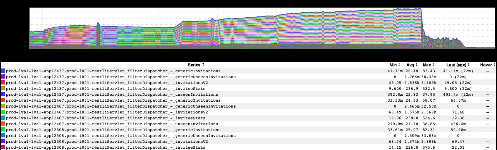
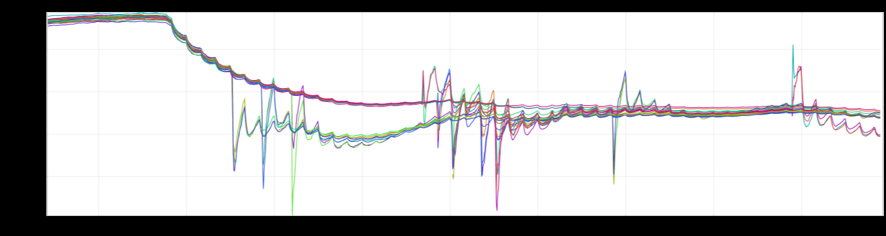
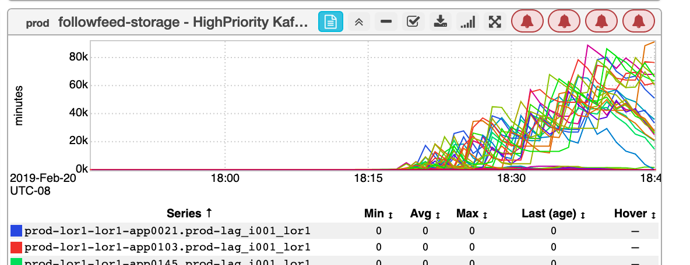
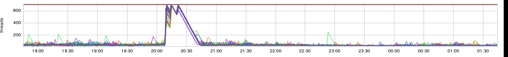

+++
title = "Unintentional Art (April 2021)"
date = "2021-04-24"
slug = "unintentional-art-april-2021"
draft = false
+++

This week we've got a few bits 'n' bobs I pulled out of my backlog.

This one reminds me of a retro-futuristic rendering of a train:

This one from _Joel De Gan_ reminds me of power lines drooping down off the pole toward houses:

What I see here is a pile of praying mantises crawling all over one another, trying desperately to get out of the right side of the frame:

...and this one, which looks kinda like a rainbow-barfing shark cresting up out of the water:

Finally, this one doesn't really "look like" much of anything, but I do believe it's the oldest ingraphs snapshot I have (circa June 2014). It's likely also the largest, clocking in at a whopping 12097x2497:

