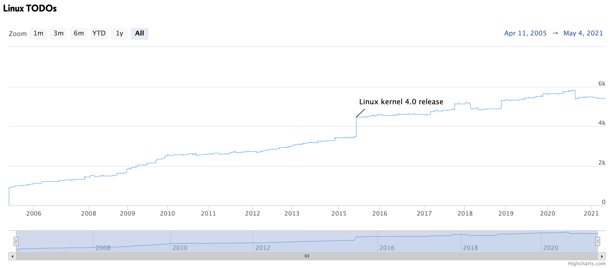
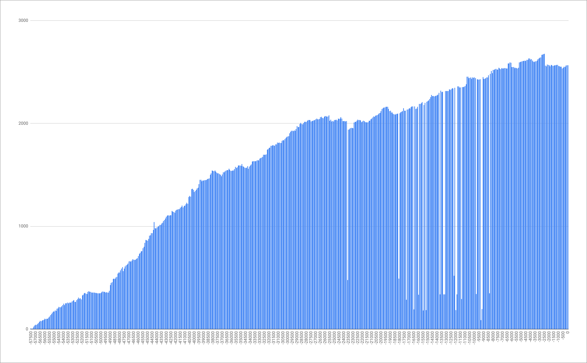

+++
title = "TODO"
date = "2021-05-26"
slug = "todo"
draft = false
+++

[I recently came across a post about plotting the TODO history of a handful of popular open source projects. For example, here's what the TODOs for the ](https://schleiss.io/plotting-source-code-todos-for-open-source-projects) Linux kernel look like over time:

I thought it might be interesting to do something similar with LinkedIn source code. We've got quite a bit of code lying around, so for the purposes of scoping I decided to select a relatively-large multiproduct with a reasonably-long commit history. To wit: voyager-api.

Some statistics:

$ find . -type f | wc -l 28964

$ git rev-list --all --count 60064

~29K files and ~60K commits seems "big enough".

I *also* didn't want to spend a whole lot of time fiddling with this, so after a bit of trial-and-error I settled on the following:

#!/bin/bash

for i in `seq 0 600`; do let rev=$i*100 count=$(git --no-pager grep -I -F TODO HEAD~$rev | wc -l) echo "$rev: $count" done

This spit out a nice little two-column chunk of text that I could then pull into a spreadsheet, reverse, and generate a graph from:

A few interesting tidbits to note here:

This is in order from "earliest commit to HEAD" rather than by date, mostly because this was easy to do. (If anyone has ideas on a simple way to do this by date without doing a whole bunch of work matching commits to timestamps, I'm all ears.) While voyager-api has ~60K commits, I "chopped off" all the data points before -57500. This is because the greps started failing beyond that commit (for reasons I don't grok, and spent zero time researching). There are some "gaps" in the data. There is apparently a bug in git grep whereby it segfaults on some revisions and only returns partial data. I decided to just leave these as-is. (Again, zero time researching.) This is obviously going to miss TODOs that aren't all-caps. I played with case-insensitive matching, but found that it was catching a bunch of non- TODO strings (e.g., activityUrn**ToDo**mainEntityUrnMap). Ultimately I decided TODO was both good enough and reasonably unlikely to capture non-todo strings. I spent a little time fiddling with grepping for TODOs in diffs - i.e., count=$(git diff HEAD~$rev | grep -c TODO) - but ultimately abandoned this because it would've meant extra work to determine whether the TODO was added/removed (+/-). I thought it might be kind of cool to see where TODOs were introduced/closed out, and I may pursue this in the future. git grep -i fuck on voyager-api returns zero results. This actually floored me. Way to keep it clean, Voyager devs!

Anyhow, this was a fun bit of quick-and-dirty research. Feel free to use it to answer the question: Are *your* TODOs getting TODONE?
