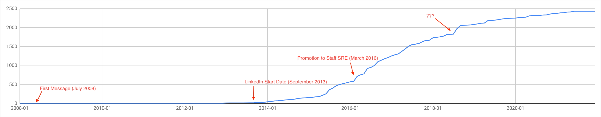

+++
title = "Messaging"
date = "2021-06-11"
slug = "messaging"
draft = false
+++

Earlier this week I came across [Kehoe's post](https://www.linkedin.com/feed/update/urn%3Ali%3Aactivity%3A6805887485118361600/) about some [analysis he did on his LinkedIn Messaging inbox (which mirrored a ](https://michael-kehoe.io/post/recruiter-reachouts-2021/)[similar analysis that ](https://www.linkedin.com/pulse/linkedin-recruiters-over-time-benjamin-kane/)_Benjamin _ _Kane_ had done). I decided I'd go ahead and take a look at my own LinkedIn messages over time:

This diverges from Kehoe & Kane's work in a couple of ways.

First of all: I generated the chart in a spreadsheet. (It was just plain the simplest way to get what I wanted in ~10-15 minutes.)

Also, I didn't leave any messages out; i.e., this includes every message I've either received *or* sent. This is significant, as I supported Messaging (and it's predecessor "Inbox") for several years. I *suspect* some of the upticks (e.g., the sharpish one in mid-2018) were likely due to some new feature launch, during which I was messaging back-and-forth with other folks on the Messaging team to test out that new feature...but I'm also lazy, so I haven't vetted out this ramp timeline theory.

Anyhow, this was a fun way to blow an hour or so fiddling with my member data, and I may go back and check out some of the rest of it. For instance, I think tracking connection count over time could be interesting (if it's even possible).

[Worth calling out: If you're interested in doing similar but you're unsure about how to go about it, Kane provides some nice instructions in his post. Go grab ](https://www.linkedin.com/pulse/linkedin-recruiters-over-time-benjamin-kane/) your data and see what interesting things you can find.

Happy fiddling, folks!
