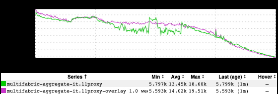
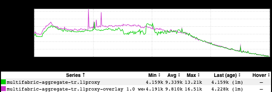

+++
title = "Euro 2020"
date = "2021-06-17"
slug = "euro-2020"
draft = false
+++

[It was delayed a year due to The 'Vid, but the the UEFA European Championship](https://en.wikipedia.org/wiki/UEFA_European_Championship) is once more upon us. I thought I'd do a bit of a reprise of [the last time](/igotw/2016-06-16-euro-2016/) and take another peek at its impact to site traffic. I also thought it might be interesting to compare two traffic from two teams' respective countries while they were playing a match. ...and so I give you Italy vs. Turkey:

On the whole the patterns are pretty similar during the game. One of particular bit that I love: everyone came back to the site at halftime. I'm imagining a pubful of soccer hooligans standing up at the 45' mark - "Awright, mates, I'm off to spend a penny and update my LinkedIn profile. Back in a bit, then."

[Taking a peek at the stats it looks like Italy dominated this one. It was scoreless at the half, with the first goal - an own goal on Turkey's Demiral, no less! - ](https://www.uefa.com/uefaeuro-2020/match/2024447--turkey-vs-italy/statistics/?iv=true) coming at 53'. Now, maybe the Turks just aren't as into *futbol* as the Italians...but I think watching a game in which their team only took 3 shots on goal *total* started to take its toll after that own goal. They just gradually started tuning out and going on about their business. By contrast, Italy stuck around to watch their team take a 3-0 win - note the sharp jump back to WoW traffic levels at the end of the game.

[The Euros go through approx. mid-July. If you want to see who's tuning in, this is a pretty good dashboard to use: http://ingraphs.prod.linkedin.com](http://ingraphs.prod.linkedin.com/dashboard/traffic-top20-cc/) [/dashboard/traffic-top20-cc/](http://ingraphs.prod.linkedin.com/dashboard/traffic-top20-cc/)
