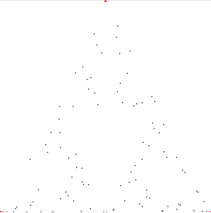
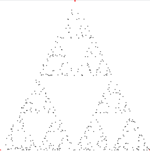
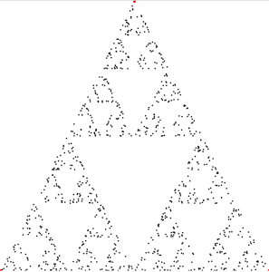
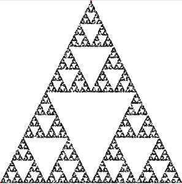
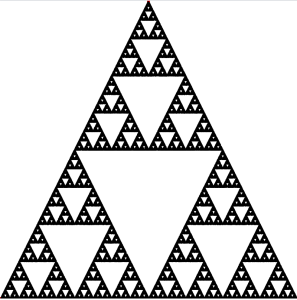

+++
title = "Sierpiski Triangles"
date = "2021-07-01"
slug = "sierpinski-triangles"
draft = false
+++

Last week I came across [this post about creating ](https://boingboing.net/2021/06/24/the-chaos-game-creates-patterns-from-random-dice-rolls.html)[Sierpiski triangles by drawing dots in relation to three points of a starting triangle. The thing that stood out ](https://en.wikipedia.org/wiki/Sierpi%C5%84ski_triangle) to me is that these dots are *randomly selected* (within a set of constraints). It doesn't matter which starting triangle you choose, where you start drawing your dots, etc...it always converges on the same pattern.

My mind was blown; I think my initial reaction was something like "[Whoa](https://www.youtube.com/watch?v=u68iT0DPYdM)[", followed by something like "Nuh-uh", and then sort of devolving into "Hmmmmm](https://www.youtube.com/watch?v=XF2ayWcJfxo)".

Anyhow, last Friday was Play inDay so I decided to have a little fun with it - largely with the purpose of convincing myself that this wasn't bullshit.

[Here's what I came up with.](http://lor1-0000279.int.linkedin.com:14557/static/serp.html)

I wanted this to be reproducible (in terms of starting parameters, not in terms of random seed), and the quickest/most straightforward way to do that was to allow for a set of query parameters specifying things like the coordinates of the starting triangle and initial dot, the number of dots to draw, the overall dimensions, and so forth. If those parameters aren't specified they're randomly generated, so feel free to refresh to your heart's content and see what interesting things happen.

Anyhow, let's take a peek at what this badboy looks like for a fixed set of parameters while increasing the number of iterations. Here's what I went with:

[http://lor1-0000279.int.linkedin.com:14557/static/serp.html?](http://lor1-0000279.int.linkedin.com:14557/static/serp.html?width=400&height=400&iter=100&p1x=1&p1y=400&p2x=400&p2y=400&p3x=200&p3y=1&startx=1&starty=1&warmup=10) [width=400&height=400&iter=100&p1x=1&p1y=400&p2x=400&p2y=400&p3x=200&p3y=1&startx=1&starty=1&warmup=10](http://lor1-0000279.int.linkedin.com:14557/static/serp.html?width=400&height=400&iter=100&p1x=1&p1y=400&p2x=400&p2y=400&p3x=200&p3y=1&startx=1&starty=1&warmup=10)

The link has **iter=100** (100 "dots"), so we'll look at that first:

Okay. We're starting to get some kind of definition of a triangle. Let's see what **iter=500** looks like:

**iter=1000**

**iter=10000**

**iter=100000**

Well, ibgd. [Fuckin' magnets](https://www.youtube.com/watch?v=rFzR_FOTq2I), amirite?
