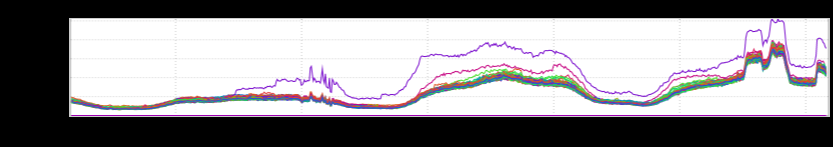
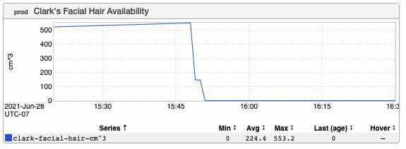
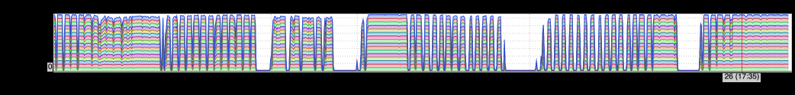
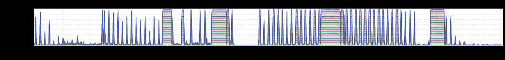
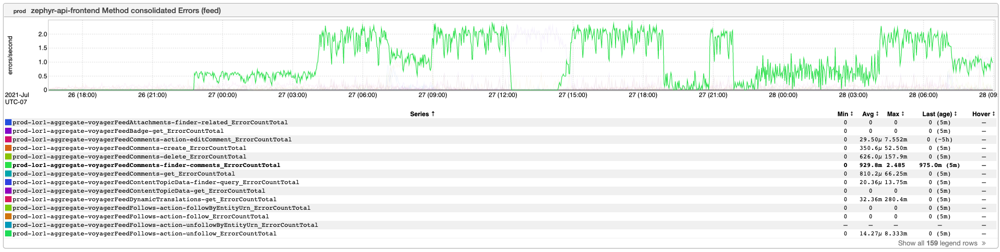

+++
title = "Unintentional Art (Alternative Edition)"
date = "2021-07-30"
slug = "unintentional-art-alternative-edition"
draft = false
+++

A funny thing happened to me yesterday. I sat down to write the igotw, and I already had a pretty good idea of what I wanted to say so it was coming pretty easily. Keyboard's clattering, I'm In the Zone, right? I got about 3/4 of the way into the post and I started to get a bit suspicious; this is an amusing little story that I think about often and that I've told before, sure, but...is this *too easy*? I did a little digging around and as it turns out *I've already written nearly* *this exact same post in 2019.* (I mean, almost verbatim.)

So. I stopped plagiarizing myself, walked away from my laptop, and decided to try again in the morning.

A friend suggested that I go ahead and post it anyway, perhaps comparing/contrasting the writing style (or something)...and I may do that at some point in the future. For now I'm going to go to that trusty old standby: UA.

Let's see what kind of goodies we've got here.

[First up is an nice little graph demonstrating a quota issue caused by a hot key. What - or rather who - was this hot key? None other than ](https://jira01.corp.linkedin.com:8443/browse/RTC-1286)[Sir Richard ](https://www.linkedin.com/in/rbranson/) [Branson...and if you're not clear on why he might've gotten so popular all of a sudden on 2021-07-11 then you likely haven't been paying attention to the ](https://www.linkedin.com/in/rbranson/) news.

Next up is a fun one from [a GCN](https://jira01.corp.linkedin.com:8443/browse/GCN-35240)_ that was created when Clark Haskinsdecided to shave off his glorious beard._

These next two are a "matched set" that _Vishnu C N_ sent my way - a pair of complementary graphs contrasting idle CPU with loopback interface traffic.

_...and last but certainly not least: a graph that helped detect a Zephyr scraping attack. Many thanks to Ryan Dohertyfor pointing out the __Abuse team's _ _writeup_ on how this was detected, investigated, and ultimately led to over 74K fake accounts being restricted.

