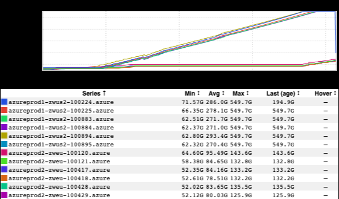

+++
title = "Two Problems"
date = "2021-08-06"
slug = "two-problems"
draft = false
+++

[There’s an old trope about “...now they have two problems](https://nedbatchelder.com/blog/201204/two_problems.html)[.” (No, not those two.) But what about when the problems don’t stop at ](https://martinfowler.com/bliki/TwoHardThings.html)*just* two? If you’ve been around a while you’ve probably seen [this kind of thing](/igotw/2016-06-23-compounded-complexity/) - one problem leading to another, which leads to another…

Suppose you’ve got a misbehaving service. In an attempt to get more information about what’s going on you turn on debug logging. Welp…

Okay, so now your log file has ballooned and filled up the filesystem. No big deal, just remove/truncate it, right? Oops, that didn’t work, it’s owned by the app user.

Enter: sudo!

[blocked URL](https://imgs.xkcd.com/comics/sandwich.png)

Hmmm...but that didn’t work, either. It looks like Midgard is complaining that it can’t create the socket file it needs for sudo forwarding.

$ df -h Filesystem      Size  Used Avail Use% Mounted on devtmpfs         32G     0   32G   0% /dev tmpfs            32G  6.1M   32G   1% /dev/shm tmpfs            32G  3.2G   29G  11% /run tmpfs            32G     0   32G   0% /sys/fs/cgroup /dev/sda2        30G   30G   20K 100% / /dev/sda1       497M  122M  376M  25% /boot /dev/sdc1       512G  512G  9.3M 100% /export /dev/sdb1       126G   61M  120G   1% /mnt/resource

Oh, the root filesystem is full, too? That’s weird - the app shouldn’t be writing anywhere in the root filesystem. Ah...but users do. For instance, when they open a gigundus log file in vim, which can’t hold the entire thing in RAM so it writes out to a temporary swap file.

No big deal - just close vim, it’ll clean up the swap file, then reconnect to allow Midgard to set up its sudo socket, and *then* delete that log file and restart the service (which isn’t doing so well at the moment, on account of the full filesystems).

Except now vim is hung on account of trying to swap a titanic log file in and out to disk (which is full). <sigh> Okay, so just kill vim...and then poke around in $HOME...and then take a peek in /tmp...and then Google “Where does vim write its swap file?”

Woops, there go the alerts! Man I guess this service *really* isn’t happy now…

Isn’t this fun?

Aren’t computers awesome?!
