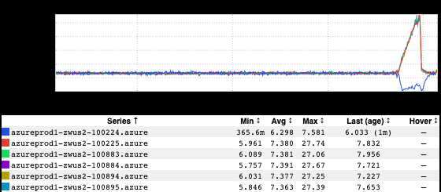
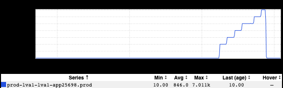
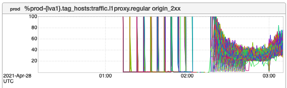
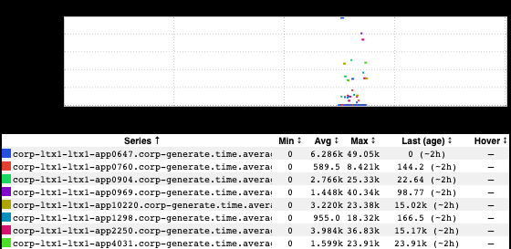
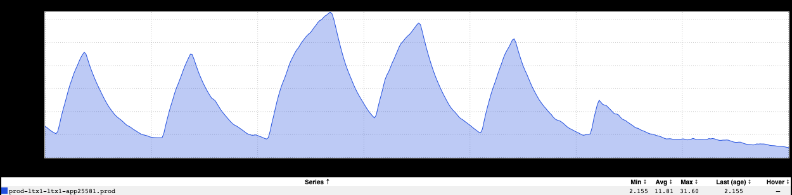

+++
title = "Unintentional Art (August 2021)"
date = "2021-08-27"
slug = "unintentional-art-august-2021"
draft = false
+++

I'm not entirely sure what happened to Summer. It's still hot, to be sure...but the kids are back in school, college football is starting up again, and Labor Day is right around the corner.

Ah, well. Let's take a look at a few bits of UA, shall we?

I dig the aesthetic of this one, but I'm not entirely sure what's going on in it. If I had to hazard a guess I'd say maybe one misbehaving host generating a client retry storm on the hosts in good working order?

This one from _Mykyta Gubenko_ has a more concrete explanation: chaos testing. Specifically, artificially injecting latency into a downstream call to see how a service handles it, resulting in this nice step function graph on 1000ms boundaries.

_The following pair of inGraphs (that I believe Kenneth Lu brought to my attention?) are actually the same, but with different parameters. They both look _ super-cool, and provide a slightly-differing window onto the goings-on of [GCN-34881.](https://jira01.corp.linkedin.com:8443/browse/GCN-34881)

_Another in the "beautiful, but confusing" category, this lil fella from Joe Gillotti makes me think of pong. Or butterflies. Or a light summer rain. Or people _ releasing paper lanterns.

_...and last but not least, Vishnu C N_ sent this one my way, entitling it "beach with strong waves".

