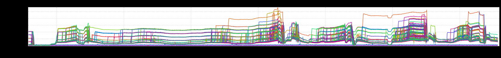

+++
title = "Patterns (Banding)"
date = "2021-09-08"
slug = "patterns-banding"
draft = false
+++

*band·ing /bandiNG/ - noun - the presence or formation of visible stripes of contrasting color.*

_While I've never talked explicitly about banding as a distinct pattern, I've posted inGraphs demonstrating the phenomenon _[on multiple occasions](/igotw/2016-11-10-load-un-balancing/). I suspect that most of the time banding is a pattern that's indicative of something not-so-good happening, and most (all?) of graphs I've posted point out some issue with load balancing - an uneven distribution of traffic among nodes. Earlier today, though, _Stufflebeezy_ posted a link to this lil beauty in Slack:

Looks a bit like sheet music, doesn't it?

...but the thing that really caught my eye: this isn't a QPS graph at all!

It's CPU banding.

Stuffles has a great (and brief) Zoom recording in which he describes tracking down the issue (see update below); if I can talk him into publishing it in a more accessible format without a Zoom passcode I'll link it here. The tl;dr is that a bit of code doing some regex matching appears to loop infinitely on certain inputs. Extrapolating from that to get to the graph above: presumably each thread that gets caught in this infinite loop consumes some steady amount of CPU...and some nodes get "lucky" and end up with multiple threads stuck in this loop.

The orange one at the top would appear to be Luckiest of All.

---

***Update*** **(2021-09-08):**[*Link to Stufflebear's recording.*](https://linkedin.zoom.us/rec/play/DFBSNCh6ELNm-5N6vD-pEqzoxuYmM_jEhaDoh43o9m2AWkzQh5bTgjrKXj4aEK2Ky0tn3Pxdb7tzHV2G.t--ZOle9sOIjzkR-?continueMode=true&_x_zm_rtaid=6X1DjziVQdyZAAzVHhqEJw.1631107241088.224044dadcf3fd27b96367160c951d11&_x_zm_rhtaid=347)
