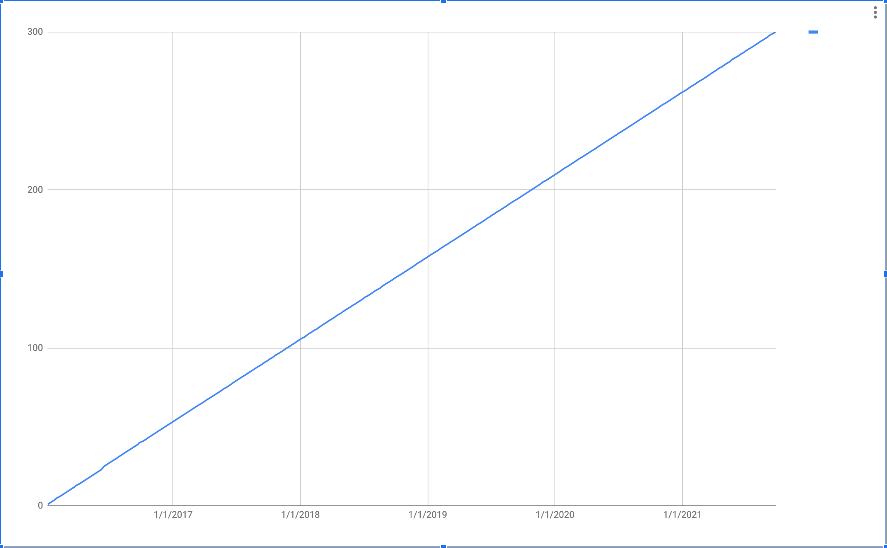

+++
title = "This. Is. Sparta."
date = "2021-09-25"
slug = "this-is-sparta"
draft = false
+++

This week marks the 300th inGraph of the Week.

The [very first "real" post](/igotw/2016-01-07-not-learning-from-mistakes/) was on January 7, 2016 - 2,088 days ago.

It was a different time.

[President Obama was in the final year of his second term.](https://en.wikipedia.org/wiki/Barack_Obama)

[Tom Petty](https://en.wikipedia.org/wiki/Tom_Petty)[ was still alive. So was Prince ](https://en.wikipedia.org/wiki/Prince_(musician))[Muhammad Ali ](https://en.wikipedia.org/wiki/Muhammad_Ali)[Alan Rickman](https://en.wikipedia.org/wiki/Alan_Rickman). [. ](https://en.wikipedia.org/wiki/Muhammad_Ali) would pass the following week. (RIP, all)

Since that time, 15,493 GCNs have been opened, and 5,123,476 tickets have been created across all JIRA projects...and counting.

Over the course of those nearly six years, I've done 38 Unintentional Art posts, 7 "pattern" posts (surprising - I thought it been more than this?), and 1... hmmm..._voice recording_; I'm not sure I'm actually allowed to call it a "podcast" if it was only 2 minutes long and I only did it the one time.

This post also happens to coincide with my 8-year work anniversary at LinkedIn. Nifty.

...and next week: #301.

Onward & Upward.

Thanks for reading, folks.
