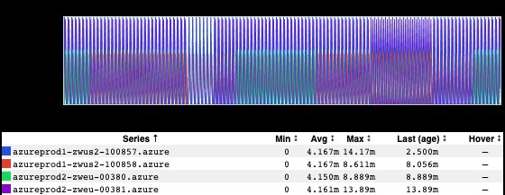
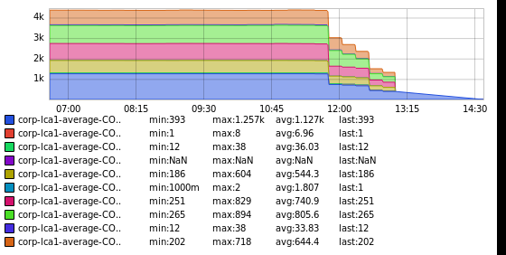
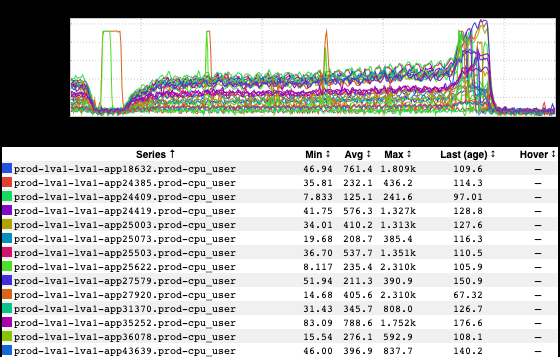
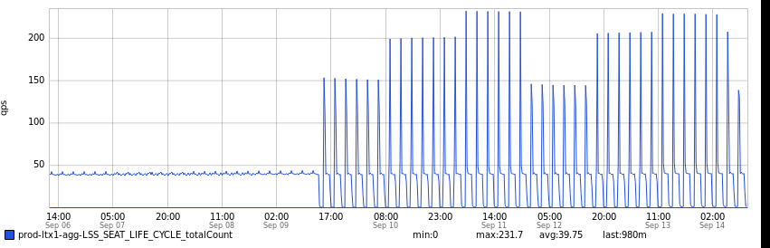
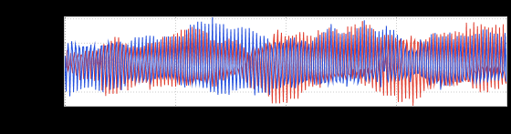

+++
title = "Unintentional Art (Synesthesia)"
date = "2021-09-30"
slug = "unintentional-art-synesthesia"
draft = false
+++

[It's been (roughly) a million years since I read A Wrinkle In Time, but there are parts of it that I still remember vividly. One of those bits is the planet with the ](https://en.wikipedia.org/wiki/A_Wrinkle_in_Time) creatures that had no eyes. When I was a kid, the idea of trying to describe the sense of sight to someone who had never had it - to an entire species who had never *seen* anything - completely blew my mind. Hell, it still does. How would you even *begin* to try to explain?

[This is what comes to mind when I think of synesthetes - folks with links between senses. It's a little different in that I don't completely lack any of my five ](https://en.wikipedia.org/wiki/Synesthesia) senses so I can at least conceptualize what it means to "see sounds" or "hear colors"...but it's similar in that no matter how well I think I understand it "on paper" I'll never actually have that experience.

I reckon this is an important lesson in the Human Condition, and one more reason why years later I consider A Wrinkle In Time to be one of the most profound books I read as a kid. (Man, don't even get me started on the fourth dimension...)

Anyhow, while there are zero forms of synesthesia in my (decidedly limited) repertoire of superpowers, certain images can evoke an unrelated sense or thought or feeling.

[For instance, I can't look at this inGraph without picturing Don Johnson in a white jacket leaning on a Ferrari:](https://www.youtube.com/watch?v=dEjXPY9jOx8)

...or this one without starting to hum a [Grateful Dead tune:](https://www.youtube.com/watch?v=pafY6sZt0FE)

[I'm not the world's biggest Jethro Tull fan, but this next one reminds me of what has (inexplicably) become one of my all-time favorite songs](https://www.youtube.com/watch?v=i19d1QnstsA):

I also can't claim to be a lover of dubstep, but I can hear the wub-wub-wub drop here:

[...and this one is only roughly theme-adjacent...but it could make a pretty decent Soundcloud logo:](https://soundcloud.com/)

