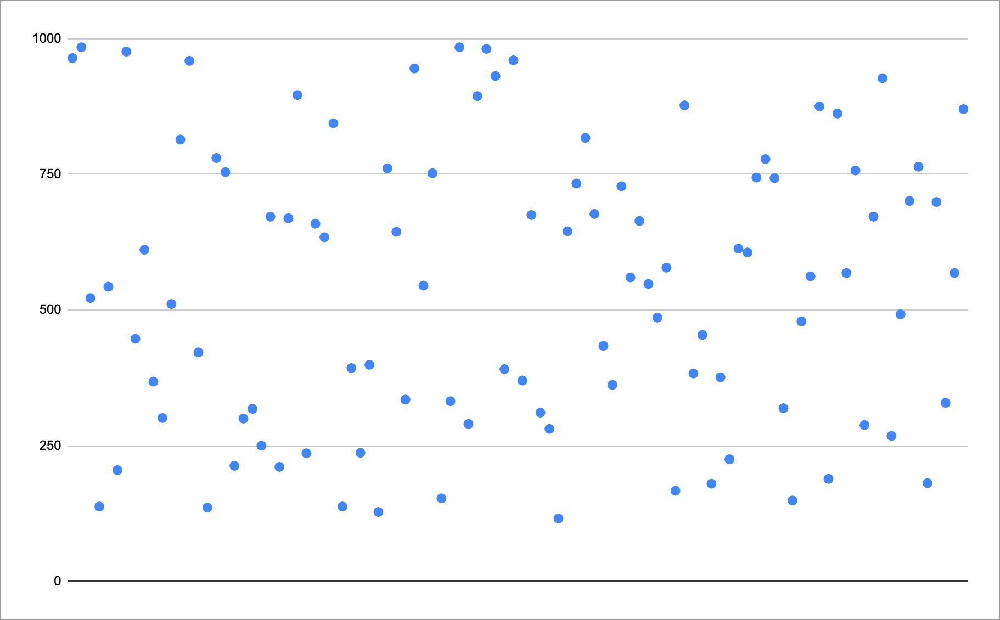
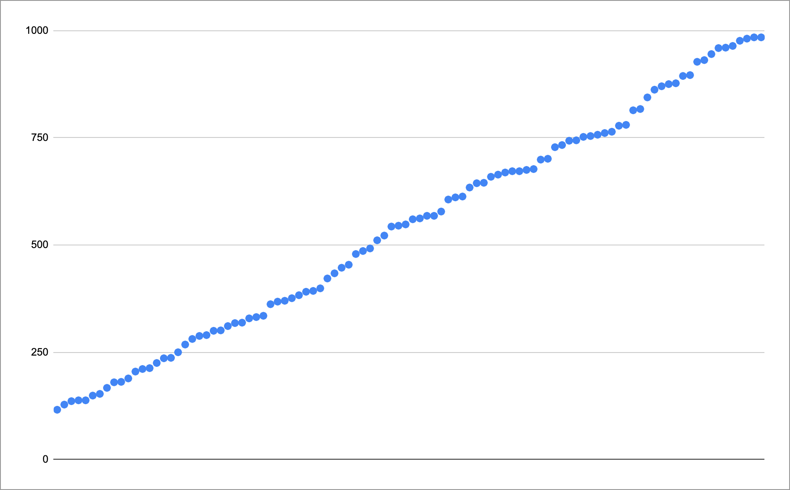
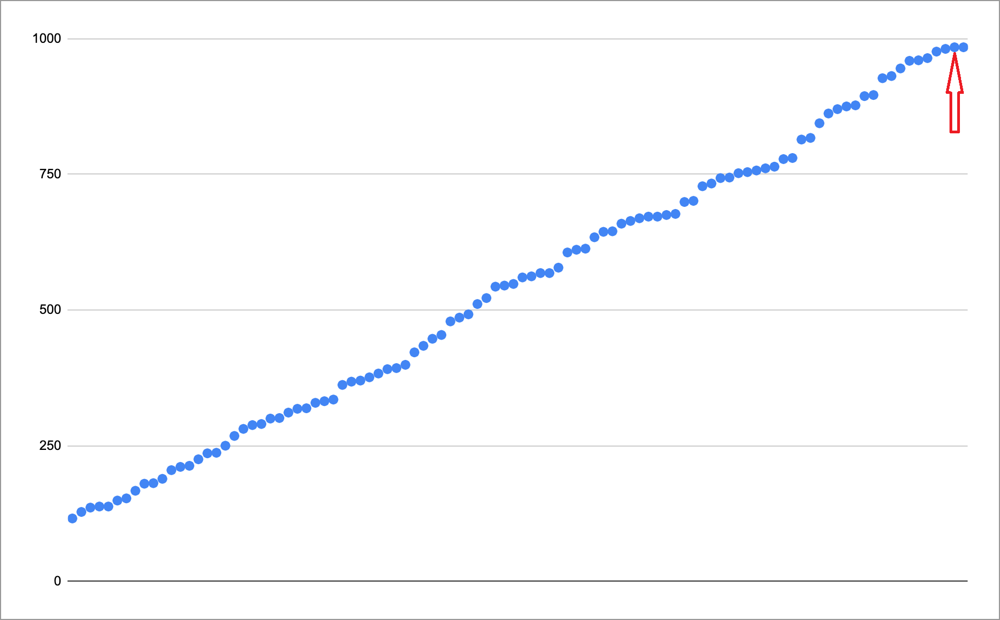
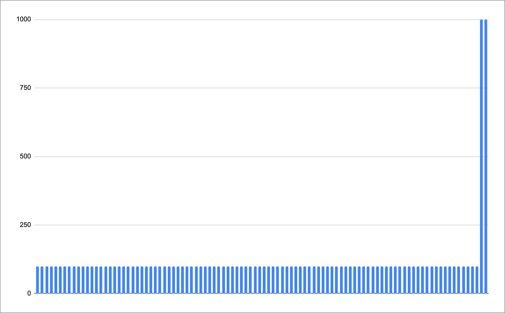
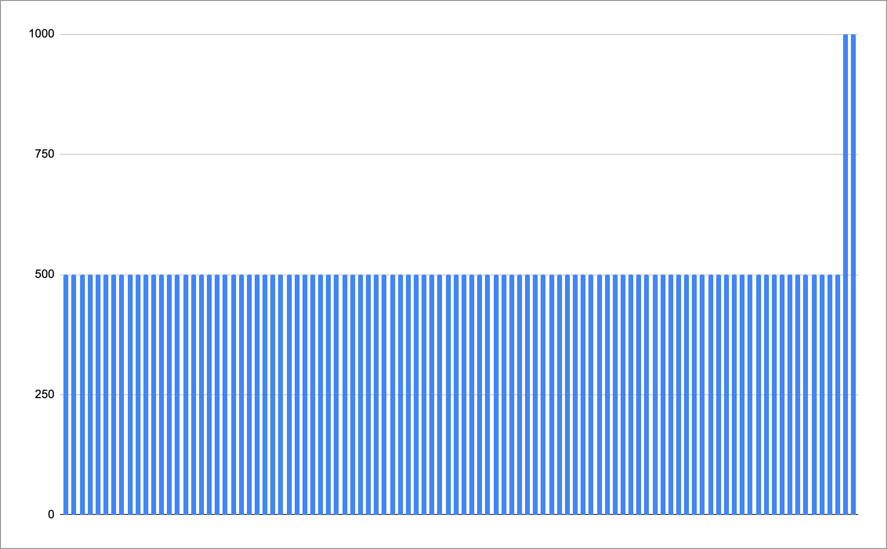
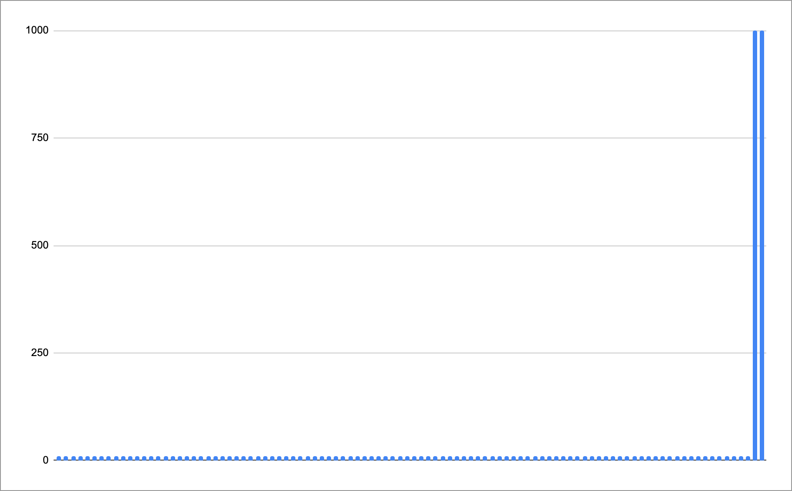
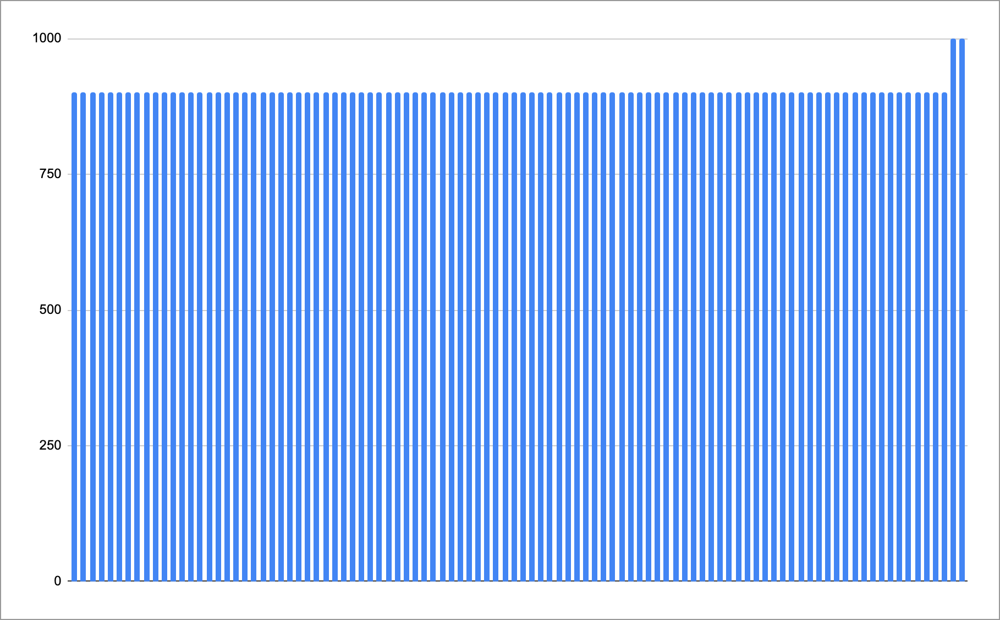

+++
title = "Percentiles (Part I)"
date = "2021-10-29"
slug = "percentiles-part-i"
draft = false
+++

*The following is adapted from a section of a monitoring talk I’m putting together. I thought these bits might be interesting/relevant here.*

Operational metrics are frequently expressed in terms of percentiles - most notably latency metrics. If you’re looking at an inGraphs dashboard that includes latencies it’ll most likely include 95th percentile (p95), or p99, or perhaps some combination therein. Some dashboards incorporate each of p50 /p95/p99 in an attempt to give some high-level idea about the overall shape of the latency distribution. While using percentiles is an improvement over using average latencies (which is a subject for another post entirely) this approach still has shortcomings.

Why?

Well, before we dive into that let’s take a look at what percentiles *are* - how they’re computed.

Suppose you have a set of latency data points for requests happening during a given minute. That might look like this:

The first thing we’re going to do is put them in ascending order:

Next, we’re going to find the index of the specific percentile we want. Supposing p99 is what we’re interested in, we do this by multiplying 0.99 by the number of data points we have (and then perhaps rounding or otherwise doing some kind of interpolation). In order to keep the arithmetic simple I used 100 data points for this example, so the data point we want is the 99th point:

...*et voila*, we’ve arrived at a p99 of...well...eyeballing the graph and assuming milliseconds (my apologies for not including units) something on the order of 990ms.

So now our window into the latency for that time period looks something like this:

This is helpful...sort of. We can now assert that the majority of our requests are being served in 990ms or less - and that's great! - but we haven’t any idea what their distribution looks like (more on this in a bit). Worse, we haven’t the faintest idea what anything “to the right” of the bucket we’ve selected looks like; it could be a jillion, for all we know. In effect, we’ve said “we simply don’t care about ~1% of our request data.”

Gross extrapolation (at the risk of being a bit hyperbolic): *We don’t care about ~1% of our users.*

To belabor this point a bit, let’s take a look at a handful of latency distributions.

I know this is a bit of an eye chart (and I switched to using bar charts, and once again provided no units...I know, I suck), but suppose this is what 100 latency data points look like in milliseconds for a given time period:

What’s the p99 latency?

If you answered “1000ms”, you are correct.

How about this one?

“Also 1000ms.” Yep.

Now this one?

“1000ms, still.” Mmhmm.

...and?

“Still 1000.” Correctamundo.

Now let's put all these next to one another:

We've established that these four graphs have identical p99 latencies. So...if p99 is what you're looking at then *what do you really know about the* *performance of your service?*

Another important bit of nuance here specific to inGraphs: inGraphs does not report on latency (or really any metric) on a per-service basis. It reports on metrics *for a particular instance of a service on a particular host*. This isn't at the root of the problem of using percentile bucketing to understand service performance characteristics, but it certainly exacerbates the problem.

Okay. So, then...if p99 (or pX for any given X) isn't providing as accurate a picture as we'd like, then What Do?

I hate to leave you hanging, Gentle Reader, but that is a subject for a later post (Part II).

Two "teasers" to keep you from being *completely* disappointed:

What if you could set a target for the latency you *want* to see from a given service, and then answer the question "What percentage of requests met that target?" What if you could see the distribution of service latencies for an arbitrary time period?

_What if, indeed..._
